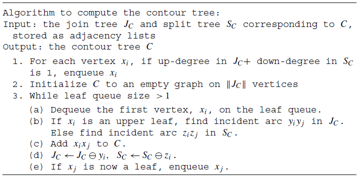

- [ ] **Computing Contour Trees in All Dimensions (Join, Split, Contour Tree) [2003]** [[Paper]](pdfs/computing_contour_trees_in_all_dimensions.pdf)
  - Contour Trees
    - Morse Theory
      - studies the chagnes in topology of level sets as the height h is varied
      - *Critical Point (CP)*: at which topology of level sets changes
      - *Morse Function*: CPs are isolated - distinct points and values
  - Contour Tree: a graph that tracks contours of the level set as they split, join, appear, and disappear
    - 
    - Define piecewise-linear function $f$ on mesh $M$
      - (1) f is a linear function within each simplex
      - (2) $f(p_i)=h_i$ for all $i=1,...,n$ 
      - "This deifinition of $f$, as a linear interpolant over a simplicial mesh with unique data vaues at vertices, ensures that $f$ is a Morse function, and that the crtical points occur at vertices of the mesh" (??????????????)
        - different value $h_i$ for $p_i$: distinct CPs
        - linear function: $lerp(h)\in(min(h), max(h))$, i.e. CPs only on vertices
    - Define *Join* and *Split*
      - Join: a CP x with $\epsilon$-neighbourhood intersecting at least 2 controus af $f(x)+\delta$
        - as $f(x)$ decrease, two contours join as 1
      - Split: a CP x with an $\epsilon$-neighbourhood that intersects at least 2 controus at $f(x)-\delta$
        - as $f(x)$ decrease, two contours split as 2
      - NOTE: $\epsilon,\delta$ suitably small values
    - *local maximum* and *local minimum*
      - *local max*: must have an  $\epsilon$-neighbourhood doesn't intersect any contours at $f(x)+\delta$
        - can only split
      - *local max*: must have an  $\epsilon$-neighbourhood doesn't intersect any contours at $f(x)-\delta$
        - can only join
    - *equivalent countours* and *contour classes*
      - two contours with heights: Y, h; Y', h'; h < h'
        - neither contours crosses a joint, split, local max, or local min
        - Y and Y' in same connected component {x: f(x) >= h}, and no join xi such that h < hi < h'
        - Y and Y' in same connected component {x: f(x) <= h'}, and no split xi such that h < hi < h'
        - **Note: meaning no additional contours between the overlap of these two -> two contours are the equivalent**
      - *finite contour classes*: contours passing CPs also the sole member of the belonging class
      - Significance:
        - contours **between two CPs ($x_i<x_j$) belong to one contour classes ($h_i<h_j$)**
        - contour classes **created at j**, **destroyed at i**
          - preserving intuitive description of a sweep from high-low values
      - interval, same contour calss
    - *CONTOUR TREE*: graph (V, E), i.e. fig. above
      - V: *supernodes*, a supernode for each finite contour class, i.e. CP
        - *interior supernode*: a CP at which
          - at least 1 infinite contour class created
          - at least 1 infinite contour class destroyed
        - *leaf supernode*:
          - a local max, 1 infinite contour class created, OR
          - a local min, 1 infinite contour class destroyed
      - E: *superarcs*, a superarc for each infinite contour class
        - superarc $(u,v)\in E$
          - an infinite contour class created at supernode u and destroyed at v
  - Augmented Contour Tree
    - argument the contour tree with remaining points
    - For each vertex $x_i$ take the contour $\gamma_i$ to which $x_i$ belongs, and insert $x_i$ into the superarc representing the contour class $[\gamma_i]$
    - Vertex, Edge = nodes, arcs 
  - **The contour tree algorithm**
    - time: $O(nlogn+N\alpha(N))$ augmented contour trees
    - space: $O(N)$ for mesh, $O(n)$ additional working storage
    - 1. build join and split tress -> 2. merge two trees
    - **Join and Split Trees**
      - two trees are dual if negating all heights
      - *height graph*:
        - G with vertices $x_i$ with heights $h_i$
        - $G^+_i$: subgraph. vertices with height > $h_i$
        - if $x_i$ a vtx in G, $y_i$ the corresponding vtx in join tree
      - Join Tree:
        - Definition 4.1: $y_i$ and $y_j$ connected if
          - (1) $x_j$ smallest-valued vtx of some connected component $\Gamma$ of $G_i^+$
          - (2) $x_i$ is adjacent in G to a vtx in $\Gamma$
        - Theorem 4.4: contour tree and mesh have the same join tree, $J_C=J_M$ 
          - can verify with fig.4
        - Algorithm 4.1 - Construct $J_M$ using Union-Find
          - 
          - Starting with highest $x_i$. After each i, all $(x_i, x_j)$ where $(h_i < h_j)$ are added to UF (i.e. in JT $x_i$ is parent and all $x_j$ are children)
          - Split tree can be constructed with negated conditions
    - **Merging**
      - Definition 4.5: $C\,\ominus\,x_i$ 
        - For $x_i$ with up-deg & down-deg <= 1
          - $C\,\ominus\,x_i=C\backslash x_i \cup x_jx_k$ (j, k are neighbour vtx)
      - 
      - With 4.1, this gives AUGMENTED contour tree
      - to get contour tree, options:
        1. apply reduction to regular vtx, whose up-/down-arcs are one
        2. Modify Algorithm 4.1:
           - LowestVertex stores vtx at which the last join or maximum occured
           - Edges added to $J_C$ when another join or global min
           - Resulting $J_C \And S_c$ contains all supernodes
             - All supernodes only in $J_C$ are added to $S_C$ with appropriate arcs