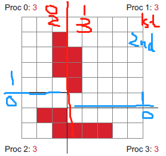

<link href="static/style.css" rel="stylesheet">

**Note: view with [Markdown Preview Enhanced](https://github.com/shd101wyy/markdown-preview-enhanced), available on VS Code,  for latex rendering.**

# Table of Content
- [Table of Content](#table-of-content)
  - [Scivis](#scivis)
    - [Distributed and Parallel Algorithms](#distributed-and-parallel-algorithms)
    - [Data Reduction and SR](#data-reduction-and-sr)
    - [Deep Surrogate](#deep-surrogate)
    - [Uncertainty and Ensemble Vis](#uncertainty-and-ensemble-vis)
    - [Rendering](#rendering)
    - [Feature (Detection, Tracking)](#feature-detection-tracking)
    - [Flow Vis](#flow-vis)
    - [Particle](#particle)
    - [XAI](#xai)
    - [Topology and Computational Geometry](#topology-and-computational-geometry)
  - [Deep Learning](#deep-learning)
    - [Transformer](#transformer)
    - [Implicit Representation](#implicit-representation)
    - [Point Cloud](#point-cloud)
    - [Autoencoder](#autoencoder)
    - [Generative Model](#generative-model)
    - [Uncertainty Quantification](#uncertainty-quantification)
    - [NN Optimization and Theory](#nn-optimization-and-theory)
  - [Computer Graphics](#computer-graphics)
    - [Path Tracing: Denoising](#path-tracing-denoising)
    - [Path Tracing: Path Guiding](#path-tracing-path-guiding)
    - [Mipmaping](#mipmaping)
  - [Other Topics](#other-topics)

## Scivis

---

### Distributed and Parallel Algorithms

- [x] **Asynchronous and Load-Balanced Union-Find for Distributed and Parallel Scientific Data Visualization and Analysis [TVCG, 2021]**, J. Xu et al.  [[Paper]](pdfs/Asynchronous-Load-Balanced-Union-Find.pdf)
  > Global synchronization and imbalanced workload, as two bottlenecks of distrubuted and parallel Union-Find algorithm used for critical point tracking and super-level set extraction, are proposed to be improved by asynchronous communication and data redistribution.
  - Asynchronous communication:
    - Changes from global sync:
      - ~~Unit by rank/size~~: unit by ID (local, no comm)
      - edge passing -> made async
      - grandparents query -> made async
    - convergence
      - boundary case handled (e.g. local root with set root parent will be prevented querying grandparents until a change in set root), no cycles (unit by ID), at least one edge consumed/iteration -> converge/terminate in finite iteration with disjoint set tree of rank 2
    - correctness
      - edge union order doesn't matter (ID is unique globally) -> two elements in a connected component always belongs to the same disjoint set, convergence with ran 2 -> ideal disjoint set guaranteed with smallest ID element as set root
  - k-d split data Redistribution:
    1. start with all processes in one group and the complete data domain
    2. find dim's median coordinate
    3. split processes in even/odd groups
    4. exchange data between splitted processes s.t. even got data below median and odd got others
    
   

  > Takeaways:
  > - distributed algorihtm accelerated by overlapping comm with computation (async)
  >   - async algorithm's result correctness: same as sync or other correct outcomes
  >   - load balancing
  > - k-d tree: effectively balance spatial data partition

 

- [ ] **Unordered Task-Parallel Augmented Merge Tree Construction [TVCG, 2021]** K. Werner and C. Garth [[Paper]](pdfs/Unordered_Task-Parallel_Augmented_Merge_Tree_Construction.pdf)

 

- [ ] **Optimization and Augmentation for Data Parallel Contour Trees [TVCG, 2021]** H. Carr, O. Rubel, G. H. Weber and J. Ahrens [[Paper]](pdfs/Optimization_and_Augmentation_for_Data_Parallel_Contour_Trees.pdf)
  - *Parallel Peak Pruning*, as a data parallel contour tree (CT) algorithm, is inefficient for augmented CT.
    - **Hyperstructure**, a data stucture that provides efficient parallel access to CT for augmentation and processing, is used to accelerate augmented CT construction.

 

- [ ] **Scalable Contour Tree Computation by Data Parallel Peak Pruning [TVCG, 2019]** H. A. Carr, G. H. Weber, C. M. Sewell, O. Rübel, P. Fasel and J. P. Ahrens [[Paper]](pdfs/Scalable_Contour_Tree_Computation_by_Data_Parallel_Peak_Pruning.pdf)

 

---

 

### [Data Reduction and SR](data-reduction.md)

 

---

### Deep Surrogate

- [x] **InSituNet: Deep Image Synthesis for Parameter Space Exploration of Ensemble Simulations [TVCG, 2019]**, W. He et al. [[Paper]](pdfs/InSituNet.pdf)
  > using visualization image generated in-situ as supervision, train an NN that predicts image given simulation and visualization parameter

- [ ] **NNVA: Neural Network Assisted Visual Analysis of Yeast Cell Polarization Simulation [TVCG, 2020]**, S. Hazarika, H. Li, K. -C. Wang, H. -W. Shen and C. -S. Chou [[Paper]](pdfs/NNVA_Neural_Network_Assisted_Visual_Analysis_of_Yeast_Cell_Polarization_Simulation.pdf)
  > A neural surrogate of simulation with numerou parameters is utilized as a foundation of uncertainty visualzation, parameter sensitivity, parameter optimization, and model diagnosis.

---

 

### [Uncertainty and Ensemble Vis](vis-uncertain-ensemble.md)

 

---

 

### [Rendering](render.md)

 

---

 

### [Feature (Detection, Tracking)](feature.md)

 

---

 

### [Flow Vis](flow.md)

 

---

 

### [Particle](vis-point.md)

 

---

### XAI

- [ ] **Interactive Visual Study of Multiple Attributes Learning Model of X-Ray Scattering Images [TVCG, 2020]** [[Paper]](pdfs/Interactive_Visual_Study_of_Multiple_Attributes_Learning_Model_of_X-Ray_Scattering_Images.pdf)
  - interactive vis system for training, debugging, and refinement of x-ray image classification models with multiple structual attributes
  - x-ray image classification model's input, activation, and predction vectors are used three data spaces to perform attribute comparison with 2D projection view, correlation matrix view in their vis system.

 

---

### Topology and Computational Geometry

- [ ] **A Domain-Oblivious Approach for Learning Concise Representations of Filtered Topological Spaces for Clustering [TVCG, 2021]** [[Paper]](pdfs/A_Domain-Oblivious_Approach_for_Learning_Concise_Representations_of_Filtered_Topological_Spaces_for_Clustering.pdf)
  - Distance between persistent diagrams is a meausure of topological similarity. With traditional persistent diagram representation like histogram, the computationally expensive Wasserstein distance is used. The author propose a 64-bit binary representation, to which a persistent diagram is transformed by a neural hash encoder such that the hamming distance between codes approximates the Wasserstein distance between the corresponding persistent diagrams.

 

- [ ] **Mesh Fundamentals**
  - Simplex
    - generalization of triangle or tetrahedron to arbitrary dimensions
    - 0-simplex: point; 1-simplex: line segment; 2-simplex: trangle; 3-simplex: tetrahedron; 4-simplex: 5-cell
  - Simplicial Complex
    - SC K: a set of simplices that
      - every face of a simplex from K is also in K
      - non-empty intersection of any two simplices $\sigma_1,\sigma_2\in\Kappa$ is a face of both $\sigma_1 and \sigma_2$
  - Manifold
    - edge: incident to only 1 or 2 faces
    - vertex: incidenting faces form a closed or open fan
      - closed fan: no boundary
      - open fan: with manifold boundary

 

- [ ] **FTK: A Simplicial Spacetime Meshing Framework for Robust and Scalable Feature Tracking [TVCG, 2021]** [[Paper]](pdfs/FTK_A_Simplicial_Spacetime_Meshing_Framework_for_Robust_and_Scalable_Feature_Tracking.pdf)

 

- [ ] **Screened Poisson Surface Reconstruction [ToG, 2013]** [[Paper]](pdfs/Screened_Poisson_Surface_Reconstruction.pdf)
  > point cloud surface reconstruction with implicit function
- Why optimize equal divergence leads to equal gradient function?
  - Why $\nabla dot\nabla f=\nabla dot G -> \nabla f= G $

 

- [ ] **Poisson Surface Reconstruction [2006]** [[Paper]](pdfs/poissonrecon.pdf)
  - Reconstruct a watertight traingulated approximation of the surface by approximating an indicator function with poisson system and extracting the isosurface
    - input: point set with inward normal
    - indicator function: inside 1, outside 0, gradient 1 along boundary
    - Challenge:
      - How to compute indicator function?
      - $M$ solid with boundary $\partial M$
      - $\chi_M$ indicator function of M
      - $\tilde{F}(q)$ smoothing filter, $\tilde{F}_p(q)=\tilde{F}(q-p)$ translation to p
      - $\overrightarrow{N}_{\partial M}(p)$ inward surface normal at p
      - $\mathscr{P}_s \in \partial M$ a patch of boundary
    $$
    \begin{align}
    \begin{split} \tag{1}
    \frac{\partial}{\partial x}|_{q0}(\chi_M*\tilde{F}) & =\frac{\partial}{\partial x}|_{q=q_0}\int_M\tilde{F}(q-p)dp \\
        & = \sum_{s\in S}\int_\mathscr{P_s}\tilde{F_p}(q)\overrightarrow{N}_{\partial M}(p)dp \\
        & = \sum_{s\in S}|\mathscr{P_s}|\tilde{F_{s.p}}(q)s.\overrightarrow{N} \\
        & = \overrightarrow{V}(q)
    \end{split}
    \end{align}
    $$

  - Page two proof, second step

 

- [ ] **Computing Contour Trees in All Dimensions (Join, Split, Contour Tree) [2003]** [[Paper]](pdfs/computing_contour_trees_in_all_dimensions.pdf)
  - [ContourTree Markdown](ContourTree.md)

---

## Deep Learning

---

 

### [Transformer](trans.md)

 

---

 

### [Implicit Representation](implicit.md)

 

---

 

### [Point Cloud](dl-point.md)

 

---

### Autoencoder

- [ ] **Masked Autoencoders Are Scalable Vision Learners** [[Paper]](pdfs/masked_ae_scalable_vision_learner.pdf)

 

- [ ] **Multiscale Mesh Deformation Component Analysis with Attention-based Autoencoders [TVCG, 2021]** [[Paper]](pdfs/Multiscale_Mesh_Deformation_Component_Analysis_with_Attention-based_Autoencoders.pdf)

 

- [ ] **Recent Advances in Autoencoder-Based Representation Learning [NIPS, 2018]** [[Paper]](pdfs/vae_rep_learning_2018.pdf)

---

 

### [Generative Model](generative.md)

 

---

### Uncertainty Quantification

- [ ] **Basic Framework and Main Methods of Uncertainty Quantification [arxiv, 2020]** [[Paper]](pdfs/6068203.pdf)

 

- [ ] **A Review of Uncertainty Quantification in Deep Learning: Techniques, Applications and Challenges [arxiv, 2020]** [[Paper]](pdfs/UQ_in_DL_survey.pdf)

 

---

### NN Optimization and Theory

- [ ] **A Metric Learning Reality Check [arxiv, 2020]** [[Paper]](pdfs/metric-learning-reality-check.pdf)

 

- [ ] **On the Spectral Bias of Neural Networks [ICML, 2019]** (Yoshua Bengio group) [[Paper]](pdfs/spectral-bias-dl.pdf)

 

- [ ] **Bag of Tricks for Image Classification with Convolutional Neural Networks [arxiv, 2018]** Mu Li, AWS [[Paper]](pdfs/bad-of-tricks-cv-training.pdf)
  - Training Image Preprocessing
    - get an image and decode to 32-bit
    - randomly crop
    - 0.5 chance flip honrizontally
    - scale hue, satruation, brightness with coefficients [0.6, 1.4]
    - PCA noise coefficient from N(0, 0.1)
    - normalize RGB by subtracting 123.68, 116.779, 103.939 and dividing yb 58.393, 57.12, 57.375

 

- [ ] **Relational inductive biases, deep learning, and graph networks [arxiv, 2018]** DeepMind, Google Brain, MIT, U of Edinburgh [[Paper]](pdfs/indictive-biases-dl.pdf)

 

- [ ] **Model Evaluation, Model Selection, and Algorithm Selection in Machine Learning [arxiv, 2018]** [[Paper]](pdfs/1811.12808.pdf)

---

## Computer Graphics

---

### Path Tracing: Denoising
- [ ] **Weakly-Supervised Contrastive Learning in Path Manifold for Monte Carlo Image Reconstruction [SIGRAPH, 2021]** [[Website]](https://www.notion.so/iycho/Weakly-Supervised-Contrastive-Learning-in-Path-Manifold-for-Monte-Carlo-Image-Reconstruction-d3f58f37e33b491d8fdaef43814c3a3c)

 

### Path Tracing: Path Guiding
- [ ] **Hierarchical Neural Reconstruction for Path Guiding Using Hybrid Path and Photon Samples [SIGGRAPH, 2021]** [[Paper]](pdfs/shilinsig21.pdf)

 

### Mipmaping
- [ ] **NeuMIP: Multi-Resolution Neural Materials [SIGGRAPH, 2021]** [[Paper]](pdfs/neumip_final.pdf)

 

---
## Other Topics

- [ ] **Full Transport General Relativistic Radiation Magnetohydrodynamics for Nucleosynthesis in Collapsars [arxiv, 2020]** [[Paper]](pdfs/1912.03378.pdf)

 

- [x] **Bigtable: A Distributed Storage System for Structured Data [2006]** Google [[Paper]](pdfs/bigtable-osdi06.pdf)
  > Bigtable: sparse, distributed, persistent multi-dimensional sorted map:
  > (row:string, column:string, time:int64) -> string (uninterpreted bytes)
  - row:
    - up to 64KB string, usually 10-100 bytes
    - read/write of row are atomic
      - ease of reasoning concurrent updates
    - row range dynamically partitioned; sorted lexicographically
      - efficient reads of short row ranges
      - can exploit locality with similar lexicographic ordered strings and their row ranges stored near each other
  - column:
    - grouped into *column families*: basic unit of access control and disk memory accounting
      - naming: *family:qualifier*
        - ex: in Webtable, anchor:[name of referring site]
      - expect # of distinct families to be small and families rarely change while columns do 
  - timestamp:
    - 64-bit integer
    - different versions of cell stored in decreasing timestamp order
  - Infrastructure
    - distributed Google File System
    - *SSTable* file format
      - persistent ordered immutable map
      - a sequence of blocks with block index for single disk seek lookup
    - distributed lock service: Chubby
      - 5 replicas. 1 elected master and serve request
      - Paxos algorithm for replica consistency in failure
      - Used for
        - ensure at most one active master
        - store bootstrap location of Bigtable data
        - discover tablet servers and finalize tablet server deaths
        - store Bigtable schema information
        - store access control list
  - Implementation
    - 3 components:
      - library linking every client
      - one master server
        - management of tablet servers; GFS garbage collection
      - many tablet servers
        - each manages a set of tablets: read/write/split