<link href="static/style.css" rel="stylesheet">

**Note: view with [Markdown Preview Enhanced](https://github.com/shd101wyy/markdown-preview-enhanced), available on VS Code,  for latex rendering.**

# Table of Content
- [Table of Content](#table-of-content)
  - [Scivis](#scivis)
    - [Distributed and Parallel Algorithms](#distributed-and-parallel-algorithms)
    - [Data Reduction](#data-reduction)
    - [Super-Resolution](#super-resolution)
    - [Deep Surrogate](#deep-surrogate)
    - [Uncertainty and Ensemble Vis](#uncertainty-and-ensemble-vis)
    - [Rendering](#rendering)
    - [Time-Varying](#time-varying)
    - [Feature (Detection, Tracking)](#feature-detection-tracking)
    - [Flow Vis](#flow-vis)
    - [Particle (Need This Separate?)](#particle-need-this-separate)
    - [Similarity and Comparison](#similarity-and-comparison)
    - [Topology and Computational Geometry](#topology-and-computational-geometry)
  - [Deep Learning](#deep-learning)
    - [Neural Rendering](#neural-rendering)
    - [Transformer](#transformer)
    - [Implicit Representation](#implicit-representation)
    - [Point Cloud](#point-cloud)
    - [Autoencoder](#autoencoder)
    - [Generative Model](#generative-model)
      - [GAN](#gan)
      - [Normalizing Flow](#normalizing-flow)
      - [Energy-Based Models](#energy-based-models)
      - [VAE](#vae)
    - [Uncertainty Quantification](#uncertainty-quantification)
    - [Image](#image)
    - [NN Optimization and Theory](#nn-optimization-and-theory)
  - [Computer Graphics](#computer-graphics)
    - [Path Tracing: Denoising](#path-tracing-denoising)
    - [Path Tracing: Path Guiding](#path-tracing-path-guiding)
    - [Mipmaping](#mipmaping)
  - [Other Topics](#other-topics)

## Scivis

---

### Distributed and Parallel Algorithms

- [x] **Asynchronous and Load-Balanced Union-Find for Distributed and Parallel Scientific Data Visualization and Analysis [TVCG, 2021]**, J. Xu et al.  [[Paper]](pdfs/Asynchronous-Load-Balanced-Union-Find.pdf)
  > Global synchronization and imbalanced workload, as two bottlenecks of distrubuted and parallel Union-Find algorithm used for critical point tracking and super-level set extraction, are proposed to be improved by asynchronous communication and data redistribution.
  - Asynchronous communication:
    - Changes from global sync:
      - ~~Unit by rank/size~~: unit by ID (local, no comm)
      - edge passing -> made async
      - grandparents query -> made async
    - convergence
      - boundary case handled (e.g. local root with set root parent will be prevented querying grandparents until a change in set root), no cycles (unit by ID), at least one edge consumed/iteration -> converge/terminate in finite iteration with disjoint set tree of rank 2
    - correctness
      - edge union order doesn't matter (ID is unique globally) -> two elements in a connected component always belongs to the same disjoint set, convergence with ran 2 -> ideal disjoint set guaranteed with smallest ID element as set root
  - k-d split data Redistribution:
    1. start with all processes in one group and the complete data domain
    2. find dim's median coordinate
    3. split processes in even/odd groups
    4. exchange data between splitted processes s.t. even got data below median and odd got others
    
   

  > Takeaways:
  > - distributed algorihtm accelerated by overlapping comm with computation (async)
  >   - async algorithm's result correctness: same as sync or other correct outcomes
  >   - load balancing
  > - k-d tree: effectively balance spatial data partition

 

- [ ] **Unordered Task-Parallel Augmented Merge Tree Construction [TVCG, 2021]** K. Werner and C. Garth [[Paper]](pdfs/Unordered_Task-Parallel_Augmented_Merge_Tree_Construction.pdf)

 

- [ ] **Optimization and Augmentation for Data Parallel Contour Trees [TVCG, 2021]** H. Carr, O. Rubel, G. H. Weber and J. Ahrens [[Paper]](pdfs/Optimization_and_Augmentation_for_Data_Parallel_Contour_Trees.pdf)
  - *Parallel Peak Pruning*, as a data parallel contour tree (CT) algorithm, is inefficient for augmented CT.
    - **Hyperstructure**, a data stucture that provides efficient parallel access to CT for augmentation and processing, is used to accelerate augmented CT construction.

 

- [ ] **Scalable Contour Tree Computation by Data Parallel Peak Pruning [TVCG, 2019]** H. A. Carr, G. H. Weber, C. M. Sewell, O. Rübel, P. Fasel and J. P. Ahrens [[Paper]](pdfs/Scalable_Contour_Tree_Computation_by_Data_Parallel_Peak_Pruning.pdf)

 

---

### Data Reduction

- [ ] **A Multi-branch Decoder Network Approach toAdaptive Temporal Data Selection andReconstruction for Big Scientific Simulation Data [BigData, 2021]** [[Paper]](pdfs/A_Multi-branch_Decoder_Network_Approach_toAdaptive_Temporal_Data_Selection_andReconstruction_for_Big_Scientific_Simulation_Data.pdf)

 

- [ ] **High-quality and Low-memory footprint Progressive Decoding of Large-scale Particle Data [LDAV, 2021]** [[Paper]](pdfs/High-quality_and_Low-memory-footprint_Progressive_Decoding_of_Large-scale_Particle_Data.pdf)

 

- [ ] **Probabilistic Data-Driven Sampling via Multi-Criteria Importance Analysis** A. Biswas, S. Dutta, E. Lawrence, J. Patchett, J. C. Calhoun and J. Ahrens [[Paper]](pdfs/Probabilistic_Data-Driven_Sampling_via_Multi-Criteria_Importance_Analysis.pdf)

 

- [x] **Distribution-based Particle Data Reduction for In-situ Analysis and Visualization of Large-scale N-body Cosmological Simulations [Pvis, 2020]**, G. Li et al. [[Paper]](pdfs/guan-li-2020-particle-reduction-distribution-n-body-cosmology.pdf)
  > Data reduction by fitting GMM (# components estimated from trials) to the k-d partitioned large-scale particle domain. leaf GMM refined until hitting a desired # of leaves. Data reconstructed post-hoc Monte Carlo.
  - two-stage spliting (1. coarse stage: [0,1]*F GMM/leaf; 2. refinement stage: F leaves)
    - 1st stage: for particle load balance
      - F # of tree nodes, T $\in$ [0, 1]  -> T*F subspaces total
      - Select leaf with most particles to partition. Partition along highest *variance* dimension on *mean* value.
    - 2nd stage: refine for distribution quality
      - spliting leaves until hitting F total # of leaves
      - split the leave with lowest *score*
        - $p_\theta(x)=\sum\limits_{i=1}^{K}\omega_i*N(\mu_i,\sigma_i)$ -> sum of probability $x$ coming from each component
        - $L(\theta|x1,...,x_n)=\prod\limits_{j=1}^{n}p_\theta(x_j)$: likelyhood of observation coming from this GMM
        - $Score:L/N$ normalized likelihood
    - Importance of T:
      - More leaves in 1st stage (larger T) -> less quality & better runtime. Vice versa.
  - Selection of # of components:
    - $AIC=2k-2ln(L(\theta|x))$ (Akaike Information Criterion)
    - $eAIC = 2k*n-\sum\limits_{i=1}^{n}2ln(L(\theta|x))$
    - fit GMM with different # of components on dataset and select the one with lowest eAIC
  - Reconstruct particle with GMM + MC sampling
  - Evaluation: 
    - physics criterion (power spectrum & halo mass function) error low, meeting domain expert's demand.
    - visualization error low
  - Future Work: visualize GMM directly non-MC (computation efficiency)
   

  > Takeaways:
  > - KDE (to get high-qual), histogram (for multidimensional) has high storage cost

 

- [ ] **CoDDA: A Flexible Copula-based Distribution Driven Analysis Framework for Large-Scale Multivariate Data [TVCG, 2019]**, S. Hazarika, S. Dutta, H. Shen and J. Chen [[Paper]](pdfs/CoDDA_A_Flexible_Copula-based_Distribution_Driven_Analysis_Framework_for_Large-Scale_Multivariate_Data.pdf)
  > A mutivariate distribution framework avoiding exponential storage cost using the Copula function
  - Copula Function/Copula:
    - multivariate CDF whose univariate margianls are uniform distribution
    - Sklar's Theorem: every joint CDF in $R^d$ implicitly consists of a d-dimensional copula function
    $$
    \begin{align}
    \begin{split} \tag{1}
    F(x_1, x_2...x_d) & = C(F_1(x_1), F_2(x_2)...F_d(x_d)) \\
                      & = C(u_1, u_2...u_d) \quad (using F_i(x_i) = u_i \sim U[0,1])
    \end{split}
    \end{align}
    $$
    $$
    \begin{align}
    \begin{split} \tag{2}
    f(x_1, x_2...x_d) & = (F_1(x_1), F_2(x_2)...F_d(x_d)) \prod_{i=1}^d f_i(x_i)\\
                      & = c(u_1, u_2...u_d) \\
                      & = \frac{\partial C(u_1...u_d)}{\partial u_1...\partial u_d}
    \end{split}
    \end{align}
    $$
      - Implication from formula, need:
        - a) univariate CDFs $F_i$
        - b) corresponding Copula $C(u_1...u_i)$
          - use Gaussian copula, derived from standard multivariate normal
            - *good for data reduction for only storing correlation matrix (?)*
      - *Gaussian Copula*
        - s
    - 2-stage
      - Univariate Distribution Estimation
      - Dependency Modelling

  > Takeaways
  > - univariate marignal CDF: marginalize all other variables and keep only one variable to compute CDF
  
 

- [x] **Statistical Super Resolution for Data Analysis and Visualization of Large Scale Cosmological Simulations [Pvis, 2019]**, K. -C. Wang, J. Xu, J. Woodring and H. -W. Shen [[Paper]](pdfs/Statistical_Super_Resolution_for_Data_Analysis_and_Visualization_of_Large_Scale_Cosmological_Simulations.pdf)
  > Data Reduction by summarizing blocks of regular grid volume as GMM, and reconstruct the high-res volume with GMM sampling + location dictionary feature vector matching (computed from *prior simulations*)
  - Mapping GMM samples to high-res locations
    - feature vector $f_h$ of block *h* composed of stat moments of $\mu,\sigma$ of self and neighbour blocks
    - spatial info look-up table: $f_h$ -> $s_i$ mapping feature of block *h* to location *i*
    - in *prior* runs, calculate the *Cross Reconstruction Error* (CE):
      - data block $h_i, h_j$; data samples $U_{h_i}, U_{h_j}$; location info $s_{h_i}, s_{h_j}$
      - $recon(h_i, h_j)=recontructed\ h_i\ with\ U_{h_i}\ with\ s_{h_j}$
      - $CE(h_i,h_j)=\frac{NormRMSE(h_i, recon(h_i, h_j)) + NormRMSE(h_j, recon(h_j, h_i))}{2}$
    - Then, optimize a distance metric in feature space (with $f_h$) to approximate CE
      - minimize $\sum\limits_{i=0}^{N}\sum\limits_{j=i}^{N}(D(f_{h_i}, f_{h_j}) - CE(h_i, h_j))^2$

    - **Question: How come this is super-res? The down-sampled data is in a form of distribution, not the actual low-res data**
   
  > Takeaways:
  > - In data reduction with GMM, sample location consideration is non-trivial, and there seems to be room for improvement or reduction/super-res methods that work with location information directly.

 

- [ ] **Image and Distribution Based Volume Rendering for Large Data Sets [Pvis, 2018]** [[Paper]](pdfs/Image_and_Distribution_Based_Volume_Rendering_for_Large_Data_Sets.pdf)

 

- [x] **Ray-Based Exploration of Large Time-Varying Volume Data Using Per-Ray Proxy Distributions [TVCG, 2020]**, K. -C. Wang, T. -H. Wei, N. Shareef and H. -W. Shen [[Paper]](pdfs/Ray-Based_Exploration_of_Large_Time-Varying_Volume_Data_Using_Per-Ray_Proxy_Distributions.pdf)
  > For a single view, summarize each pixel ray with value histogram and depth info (location of samples). Reconstruction done based on hist and depth and custome TF. Temporal coherence checked by recontructed RMSE between t and lerp(t_prev, t_next), if error low then just use lerp to save reconstruction
  - Temporal Reduce by Exploiting Coherency
    - for non-sampled TS, cast ray and compare with interpolant between 2 sampled TS. If error small then use interpolation, else save sampled ray.

   

  > Takeaways
  > - Data Reduction for spatial-temporal data: 1. compression 2. distribution summary

 

- [ ] **Homogeneity guided probabilistic data summaries for analysis and visualization of large-scale data sets [Pvis, 2017]** [[Paper]](pdfs/Homogeneity_guided_probabilistic_data_summaries_for_analysis_and_visualization_of_large-scale_data_sets.pdf)
  > partition volume with SLIC (Simple Linear Iterative Clustering) to achieve region homogeneity s.t. more compact statistical summary can be used
  - Storage
    - Regular Grid
      - botoom front left, top back right corner
    - K-D Partition
      - id of corners of each bounding box

 

- [ ] **Statistical Visualization and Analysis of Large Data Using a Value-based Spatial Distribution [Pvis, 2017]** [[Paper]](pdfs/Statistical_visualization_and_analysis_of_large_data_using_a_value-based_spatial_distribution.pdf)

 

- [ ] **In Situ Distribution Guided Analysis and Visualization of Transonic Jet Engine Simulations [SciVis, 2016]** [[Paper]](pdfs/In_Situ_Distribution_Guided_Analysis_and_Visualization_of_Transonic_Jet_Engine_Simulations.pdf)
  > in-situ block-wise incremental GMM to summarize data. Local anomoly detecte in spatial and temporal dimension based on expected GMM and EMD similarity. Overview for anamoly analysis via Superimposed comparative charts.
  - Block-wise incremental GMM (Algorithm: *Adaptive background mixture models for real-time tracking*):
    - enables in-situ GMM estimation
  - Anamoly Detection
    - Spatial Detection:
      - Over all block, compute *expected* GMM , check for outlier Block GMM with EMD
    - Temporal Detection
      - Problem: overtime anamoly might dominate and spatial detection method would fail.
      - Solution: Over time for 1 block, compute change in its GMM to define temporal anamoly

 

---

### Super-Resolution

- [x] **SSR-TVD [TVCG, 2020]** [[Paper]](pdfs/ssr_tvd.pdf)
  > Conv GAN takes inputs of a sequence of low-res volume and predicts high-res volume

  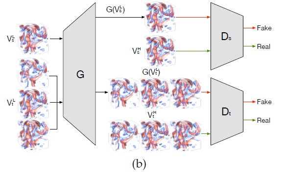

- [x] **TSR-TVD [TVCG, 2019]** [[Paper]](pdfs/tsr_tvd.pdf)
  > Recurrent Conv GAN takes input of low-res volume at start and end timestep, and predict high-res volume including intermediate ones

  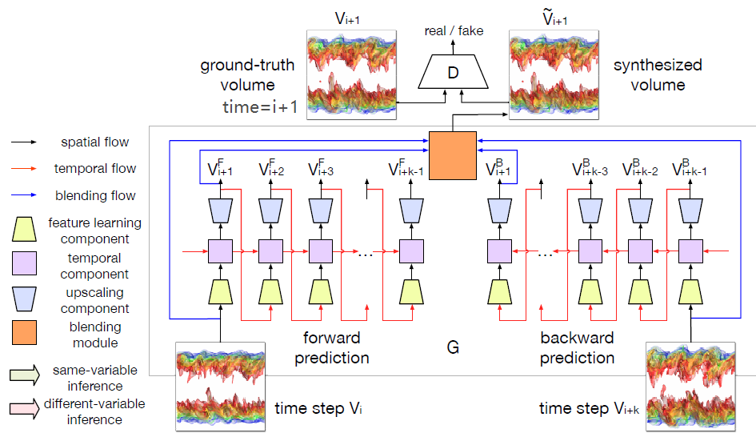

- [x] **STNET [Vis, 2021]** [[Paper]](pdfs/stnet.pdf)
  > input-output TSR-TVD: (V_start, V_end) -> (V_start, V_middles... , V_end) with a feature interpolation step before upscaling

  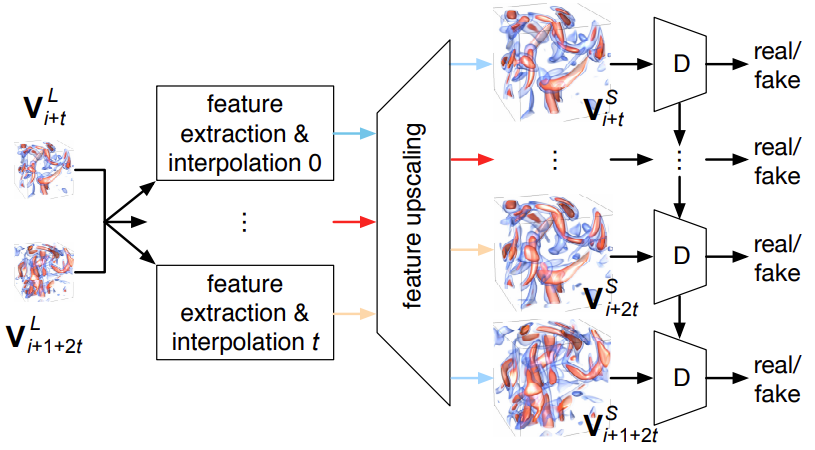

- [ ] **SSR-FVD [Pvis, 2020]** [[Paper]](pdfs/ssr_vfd.pdf)

---

### Deep Surrogate

- [x] **InSituNet: Deep Image Synthesis for Parameter Space Exploration of Ensemble Simulations [TVCG, 2019]**, W. He et al. [[Paper]](pdfs/InSituNet.pdf)
  > using visualization image generated in-situ as supervision, train an NN that predicts image given simulation and visualization parameter

- [ ] **NNVA: Neural Network Assisted Visual Analysis of Yeast Cell Polarization Simulation [TVCG, 2020]**, S. Hazarika, H. Li, K. -C. Wang, H. -W. Shen and C. -S. Chou [[Paper]](pdfs/NNVA_Neural_Network_Assisted_Visual_Analysis_of_Yeast_Cell_Polarization_Simulation.pdf)
  > A neural surrogate of simulation with numerou parameters is utilized as a foundation of uncertainty visualzation, parameter sensitivity, parameter optimization, and model diagnosis.

---

### Uncertainty and Ensemble Vis

- [ ] **Uncertainty Visualization of the Marching Squares and Marching Cubes Topology Cases [Vis Short, 2021]** Tushar M. Athawale, Sudhanshu Sane, Chris R. Johnson [[Paper]](pdfs/uncertain_visualization_of_marching_cubes_topology_cases.pdf)

 

- [ ] **Visual Analysis of Multi-Parameter Distributions across Ensembles of 3D Fields [TVCG, 2021]** [[Paper]](pdfs/Visual_Analysis_of_Multi-Parameter_Distributions_across_Ensembles_of_3D_Fields.pdf)

 

- [ ] **Uncertainty-Oriented Ensemble Data Visualization and Exploration using Variable Spatial Spreading [TVCG, 2021]** [[Paper]](pdfs/Uncertainty-Oriented_Ensemble_Data_Visualization_and_Exploration_using_Variable_Spatial_Spreading.pdf)

 

- [ ] **Ensemble Vis Survey [TVCG, 2020]** J. Wang [[Paper]](pdfs/EnsembleSurvey.pdf)
  - Uncertain Rendering:
    - Level Crossing Probability paper (Positional Uncertainty of Isocontrous...)
    - Probabilistic Marching Cubes

 

- [ ] **Uncertainty-Aware Principal Component Analysis [TVCG, 2020]** J. Görtler, T. Spinner, D. Streeb, D. Weiskopf and O. Deussen [[Paper]](pdfs/Uncertainty-Aware_Principal_Component_Analysis.pdf)

 

- [ ] **eFESTA: Ensemble Feature Exploration with Surface Density Estimates [TVCG, 2020]** W. He, H. Guo, H. Shen and T. Peterka [[Paper]](pdfs/eFESTA_Ensemble_Feature_Exploration_with_Surface_Density_Estimates.pdf)
  - s

 

- [x] **Direct Volume Rendering with Nonparametric Models of Uncertainty [TVCG, 2020]** T. Athawale and C. R. Johnson [[Paper]](pdfs/dvr_nonparametric_uncertainty.pdf)
  > Using nonparametric quantile distribution, which is mode-preserving and variance-bounded (?), analytical trilinear quantile interpolation, and TF integration over quatile distribution, uncertainty in DVR pipeline can be propagated, giving more accurate uncertain VR of w.r.t. the underlying ground truth data shown in synthetic dataset

 

- [ ] **Probabilistic Asymptotic Decider for Topological Ambiguity Resolution in Level-Set Extraction for Uncertain 2D Data [TVCG, 2019]** T. Athawale and C. R. Johnson [[Paper]](pdfs/Probabilistic_Asymptotic_Decider_for_Topological_Ambiguity_Resolution_in_Level-Set_Extraction_for_Uncertain_2D_Data.pdf)

 

- [ ] **Visualization of Uncertainty for Computationally Intensive Simulations Using High Fidelity Emulators [SciVis, 2018]** A. Biswas, K. R. Moran, E. Lawrence and J. Ahrens [[Paper]](pdfs/Visualization_of_Uncertainty_for_Computationally_Intensive_Simulations_Using_High_Fidelity_Emulators.pdf)

 

- [ ] **Information Guided Exploration of Scalar Values and Isocontours in Ensemble Datasets [Entropy, 2018]** Subhashis Hazarika, Ayan Biswas, Soumya Dutta, Han-Wei Shen [[Paper]](pdfs/entropy-20-00540.pdf)

 

- [ ] **Uncertainty Visualization Using Copula-Based Analysis in Mixed Distribution Models [TVCG, 2017]** Subhashis Hazarika [[Paper]](pdfs/Uncertainty_Visualization_Using_Copula-Based_Analysis_in_Mixed_Distribution_Models.pdf)

 

- [x] **A Statistical Direct Volume Rendering Framework for Visualization of Uncertain Data [TVCG, 2017]** E. Sakhaee and A. Entezari [[Paper]](pdfs/A_Statistical_Direct_Volume_Rendering_Framework_for_Visualization_of_Uncertain_Data.pdf)
  > Modelled ensemble scalar fields as nonparametric pdf random field (e.g. histogram) with analytical interpolation by box-spline convolution. Integrating pdfs over TF further propagates uncertainty to the DVR pipeline

  - Goal: propagate uncertainty thruout entire DVR pipeline with nonparametric model(with analytical solution)
    - Q1: what's the probability distribution of the random field at an arbitrary point along a viewing ray? (pdf interpolation)
    - Q2: how to analytically incorporate the probability distribution in the volume rendering intergral? (uncertain-aware TF classification)
  - Uncertainty modelling
    - ensemble scalar fields as random variable field with non-parametric pdfs
  - Box-Splines for Non-Parametric PDF Interpolation
    - interpolated random variable X as convolution
      - $pdf_X(x)=pdf_{w_1X_1}(x)*pdf_{w_2X_2}(x)*...*pdf_{w_KX_K}(x)$ 
        - where $pdf_{w_iX_i}=\frac{1}{w_i}pdf_{X_i}(x/w_i)$
      - (NOT UNDERSTANDING) BOX SPLINE SPACE IS CLOSED UNDER CONVOLUTION:
        - implication: conv of box-splines can be represented with anther box-spline, containing all weights as directions
        - $pdf_X(x)=M_{[w_1,w_2,...,w_K]}(x)$
          - when all $w_i=1$, box-spline is univariate B-spline with equally spaced knots. (so what? significance?)
  - Probabilistic Transfer Function Classification
    - For a random varialbe at arbitrary postion, integrate its pdf with TF.
      - Ex. Opacity: $E(\alpha)=\int\alpha(t)pdf_X(t)dt$
  - Results:
    - real-time rendering (>30 fps)
    - reveals fine features with transfer function highlighting feature isovalues, comparing to fuzzy isosurfacing, LCP field DVR, and gaussian process regression (?)

 

- [ ] **Range Likelihood Tree: A Compact and Effective Representation for Visual Exploration of Uncertain Data Sets [Pvis, 2017]** [[Paper]](pdfs/Range_likelihood_tree_A_compact_and_effective_representation_for_visual_exploration_of_uncertain_data_sets.pdf)
  - For a probability distribution field, break each pdf into ranges (cumulative denstiy) and make a Hierarchical Clustering Tree based on the similarity values (across grid points) for each range
  - 

 

- [ ] **Visual Analysis of Spatial Variability and Global Correlations in Ensembles of Iso‐Contours [EuroVis, 2016]** F. Ferstl,M. Kanzler,M. Rautenhaus,R. Westermann [[Paper]](pdfs/cgf.12898.pdf)

 

- [x] **Nonparametric Models for Uncertainty Visualization [EuroVis, 2013]** Kai Pöthkow, Hans-Christian Hege [[Paper]](pdfs/cgf.12100.pdf)
  > Explore ensemble data as nonparametric representations of (a): empirical distributions, (b): histograms, (c): KDE, instead of the previously explored Gaussian field
  > NOTE: one KDE for entir dataset; NOT on vertices
  > For KDE, methods proposed to 1) compute valid consistent marginal distributions, 2) get correlations with principal component transformation, 3) automatic bandwidth selection
  - **Nonparametric Models**
    - **Empirical Distribution (confused)**:
      - $f(y)=\sum_{i=1}^L\phi _i\delta (y-v_i)$
      - sum of $v_i=y$ weighted by $\phi_i$
      - How is this a probability
    - Historgram
    - Kernel Density Estimate
      - $f(y,H)=\sum_{i=1}^L\phi _i\kappa(y;v_i,H)$
      - flavors of bandwidith matrix H:
        - gaussian kernel: $H \lrArr \Sigma$
        - 1.) scaled identity $H=h^2I$. constant variance
        - 2.) diagonal $H=diag(h_1^2, h_2^2, ... , h_{\chi M}^2)$. individual bandwidth, no correlation
        - 3.) symmetric positive definite matrices, representing bandwidth with linear dependencies
      - bandwidth selection
        - 1.) Mean Integrated Squared Error
          - MISE(H) = $E(\int(f(x,H)-f^*(x))^2dx)$
            - approx: asymptotic MISE
        - 2.) Silverman's rule of thumb
          - $h_i=(\frac{4}{d+2})^{\frac{1}{(d+4)}}L^\frac{-1}{d+4}\sigma_i$
          - L: # of data points
    - **Marginalization**
      - For local feature probability (e.g. LCP) outside-cell points should be marginalized
      - $K_c$: # of points (i.e. dof) for cell c
      - $\chi$: # of variables per point (i.e. state space dimension)
      - Empirical Distribution
        - discard spare dimensions
      - Histogram
        - compute joint hist of local/cell points
      - KDE
        - Gaussian kernel: $H_c$ drops spare dimensions
    - **Principal Components Transformation**
      - symmetric positive definite $H$ hard to estimate in high dim
      - PCA applied to 0-mean realizations and then KDE
      - $A=[(v_{1,c}-\mu), (v_{1,c}-\mu), ..., (v_{L,c}-\mu)]$
      - $B=KLT(A)=[m(v_{1,c}-\mu), m(v_{1,c}-\mu), ..., m(v_{L,c}-\mu)]$
        - m is transformation matrix (i.e. eigenvectors in PCA(?))
    - **Feature Probability**
      - $P(c)=\int_Df_c(y_c)dy_c=\int_{\real^{\chi K_c}}f_c(y_c)I(c, y_c)d_yc=E(I(c,\cdot))$
      - $f_c$: pdf of cell
      - $I(c,y)$: feature indicator function in cell c with components y

  > Takeaways:
  > - Usage of Uncertainty in Scivis: represent data as distribution fields. Research opportunities arise in
  >   - different types of distributions (e.g. param/nonparam)
  >   - Uncertainty Propagation: integrate distribution to traditional algorihtms (LCP, DVR, etc.)

 

- [ ] **Gaussian mixture model based volume visualization [LDAV, 2012]** S. Liu, J. A. Levine, P. Bremer and V. Pascucci [[Paper]](pdfs/Gaussian_mixture_model_based_volume_visualization.pdf)
  - GMM in voxel neighborhood level or voxel ensemble level
  - **Fuzzy Rendering**
    - For each frame, each vtx draws GMM sample, ray casting.
    - Fuzzyness: different samples each frame creates varying VR.
  - **MC Integration for Static Uncertain VR**
    - Drawback of FR: needs animation to convery uncertainty/distribution
    - 

 

- [ ] **Fuzzy Volume Rendering [TVCG, 2012]** N. Fout and K. Ma [[Paper]](pdfs/Fuzzy_Volume_Rendering.pdf)

 

- [ ] **Analysis of large-scale scalar data using hixels [LDAV, 2011]** D. Thompson et al [[Paper]](pdfs/Analysis_of_large-scale_scalar_data_using_hixels.pdf)

 

- [x] **Probabilistic Marching Cubes [EuroVis, 2011]** Kai Pöthkow,Britta Weber,Hans-Christian Hege [[Paper]](pdfs/probabilistic_marching_cubes.pdf)
  - [Uncertain Isocontour Markdown](UncertainIsocontour.md)

 

- [x] **Positional Uncertainty of Isocontours: Condition Analysis and Probabilistic Measures [TVCG, 2010]** K. Pothkow and H. Hege [[Paper]](pdfs/Positional_Uncertainty_of_Isocontours_Condition_Analysis_and_Probabilistic_Measures.pdf)
  - [Uncertain Isocontour Markdown](UncertainIsocontour.md)

 

---

### Rendering

- [x] **Differentiable Direct Volume Rendering [TVCG, 2021]** S. Weiss and R. Westermann [[Paper]](pdfs/differentiable_dvr.pdf)
  - color reconstruction
    - issue with non-monotunic TF: density can get traped into local maximum
    - DiffDVR instead optimize for a RGBA field (like NeRF) insteald of intensity field

 

- [ ] **Real-Time Denoising of Volumetric Path Tracing for Direct Volume Rendering [TVCG, 2021]** J. A. Iglesias-Guitian, P. S. Mane and B. Moon [[Paper]](pdfs/Real-Time_Denoising_of_Volumetric_Path_Tracing_for_Direct_Volume_Rendering.pdf)
  - problems in real-time Volumetric Path Tracing for DVR:
    - flickers and noise
  - Proposed a denoising technique with image space linear predictor
    - advantage: great quality (not overly blurred like RNN, not affected much by out-of-sample data), no pre-training, and running real-time with commodity hardware

 

- [ ] **DNN-VolVis: Interactive Volume Visualization Supported by Deep Neural Network [Pvis, 2019]** [[Paper]](pdfs/DNN-VolVis_Interactive_Volume_Visualization_Supported_by_Deep_Neural_Network.pdf)

 

- [ ] **Explorable Volumetric Depth Images from Raycasting** S. Frey, F. Sadlo and T. Ertl [[Paper]](pdfs/Explorable_Volumetric_Depth_Images_from_Raycasting.pdf)

### Time-Varying

---

### Feature (Detection, Tracking)

- [ ] **ContourNet: Salient Local Contour Identification for Blob Detection in Plasma Fusion Simulation Data**

 

- [ ] **Geometry-Driven Detection, Tracking and Visual Analysis of Viscous and Gravitational Fingers [TVCG, 2020]** [[Paper]](pdfs/Geometry-Driven_Detection_Tracking_and_Visual_Analysis_of_Viscous_and_Gravitational_Fingers.pdf)

 

- [ ] **Deep-Learning-Assisted Volume Visualization** [[Paper]](pdfs/Deep-Learning-Assisted_Volume_Visualization.pdf)
  > CNN activations used as high-level feature representation for visualizing structural complexity of volume (e.g. bacterial cell structure) by hand-crafting a *characteristic feature vector* and find similar vectors which should represent meaningful semantics.

 

- [ ] **Details-First, Show Context, Overview Last: Supporting Exploration of Viscous Fingers in Large-Scale Ensemble Simulations** T. Luciani, A. Burks, C. Sugiyama, J. Komperda and G. E. Marai [[Paper]](pdfs/Details-First_Show_Context_Overview_Last_Supporting_Exploration_of_Viscous_Fingers_in_Large-Scale_Ensemble_Simulations.pdf)

 

- [ ] **Efficient Local Histogram Searching via Bitmap Indexing** T. -H. Wei, C. -M. Chen, A. Biswas [[Paper]](pdfs/efficient_local_histogram_searching_via_bitmap_indexing.pdf)

 

- [ ] **Distribution Driven Extraction and Tracking of Features for Time-varying Data Analysis [TVCG, 2016]** [[Paper]](pdfs/Distribution_Driven_Extraction_and_Tracking_of_Features_for_Time-varying_Data_Analysis.pdf)

---

### Flow Vis

- [ ] **Exploratory Lagrangian-Based Particle Tracing Using Deep Learning [Flow Vis & Image Processing, 2021]** [[Paper]](pdfs/2110.08338.pdf)

 

- [ ] **A Fluid Flow Data Set for Machine Learning and its Application to Neural Flow Map Interpolation [TVCG, 2021]** J. Jakob, M. Gross and T. Günther [[Paper]](pdfs/A_Fluid_Flow_Data_Set_for_Machine_Learning_and_its_Application_to_Neural_Flow_Map_Interpolation.pdf)

 

- [ ] **FlowNet: A Deep Learning Framework for Clustering and Selection of Streamlines and Stream Surfaces [VIS, 2019]** [[Paper]](pdfs/tvcg20-flownet.pdf)

 

- [ ] **Vector Field Topology of Time-Dependent Flows in a Steady Reference Frame [TVCG, 2020]** I. B. Rojo and T. Günther [[Paper]](pdfs/Vector_Field_Topology_of_Time-Dependent_Flows_in_a_Steady_Reference_Frame.pdf)

 

- [ ] **Extreme-Scale Stochastic Particle Tracing for Uncertain Unsteady Flow Visualization and Analysis [TVCG, 2019]**, H. Guo et al. [[Paper]](pdfs/Extreme-Scale_Stochastic_Particle_Tracing_for_Uncertain_Unsteady_Flow_Visualization_and_Analysis.pdf)
  - Contributions
    - Increased *Stochastic Flow Maps (SFMs)* parallelism by decoupling time dependencies
    - Adaptive refinement, estimating particle density pdf by iterations of new particle batches until convergence, to reduce SFM estimation time
    - Asyncrhonous parallel framework for stochastic parallel tracing23`1

 

- [ ] **Line Integral Convolution Paper [1993]** [[Paper]](pdfs/line_integral_convolution.pdf)

 

---

### Particle (Need This Separate?)

- [ ] **Spatial Partitioning Strategies for Memory-Efficient Ray Tracing of Particles [LDAV, 2020]** [[Paper]](pdfs/Spatial_Partitioning_Strategies_for_Memory-Efficient_Ray_Tracing_of_Particles.pdf)

 

- [ ] **Screen-Space Normal Distribution Function Caching for Consistent Multi-Resolution Rendering of Large Particle Data [TVCG, 2018]** [[Paper]](pdfs/Screen-Space_Normal_Distribution_Function_Caching_for_Consistent_Multi-Resolution_Rendering_of_Large_Particle_Data.pdf)

 

- [ ] **Memory-Efficient On-the-Fly Voxelization and Rendering of Particle Data [TVCG, 2018]** [[Paper]](pdfs/Memory-Efficient_On-the-Fly_Voxelization_and_Rendering_of_Particle_Data.pdf)

 

- [ ] **Spatio-Temporal Feature Exploration in Combined Particle/Volume Reference Frames [TVCG, 2017]** [[Paper]](pdfs/Spatio-Temporal_Feature_Exploration_in_Combined_Particle_Volume_Reference_Frames.pdf)

 

- [ ] **CAST: Effective and Efficient User Interaction for Context-Aware Selection in 3D Particle Clouds [TVCG, 2016]** [[Paper]](pdfs/CAST_Effective_and_Efficient_User_Interaction_for_Context-Aware_Selection_in_3D_Particle_Clouds.pdf)

 

- [ ] **Interactive visual exploration of a trillion particles [LDAV, 2016]** [[Paper]](pdfs/Interactive_visual_exploration_of_a_trillion_particles.pdf)

 

- [ ] **Interpolation-Based Pathline Tracing in Particle-Based Flow Visualization [TVCG, 2015]** [[Paper]](pdfs/Interpolation-Based_Pathline_Tracing_in_Particle-Based_Flow_Visualization.pdf)

 

- [ ] **MegaMol—A Prototyping Framework for Particle-Based Visualization [TVCG, 2015]** [[Paper]](pdfs/MegaMolA_Prototyping_Framework_for_Particle-Based_Visualization.pdf)

 

- [ ] **A level-set method for skinning animated particle data [SIGGRAPH, 2011]** [[Paper]](pdfs/2019406.2019409.pdf)

 

- [ ] **Feature-Based Analysis of Plasma-Based Particle Acceleration Data [TVCG, 2014]** [[Paper]](pdfs/Feature-Based_Analysis_of_Plasma-Based_Particle_Acceleration_Data.pdf)

 

- [ ] **Vortex Cores of Inertial Particles [TVCG, 2014]** [[Paper]](pdfs/Vortex_Cores_of_Inertial_Particles.pdf)

 

- [ ] **Trajectory-Based Flow Feature Tracking in Joint Particle/Volume Datasets [TVCG, 2014]** [[Paper]](pdfs/Trajectory-Based_Flow_Feature_Tracking_in_Joint_Particle_Volume_Datasets.pdf)

 

- [ ] **[Splatting Paper] Particle Splatting: Interactive Rendering of Particle-Based Simulation Data** [[Paper]](pdfs/PSIRPBSD_paper.pdf)

 

---

### Similarity and Comparison

- [ ] **S4: Self-Supervised learning of Spatiotemporal Similarity [TVCG, 2021]** [[Paper]](pdfs/S4_Self-Supervised_learning_of_Spatiotemporal_Similarity.pdf)
  - Task: identifying other occurences of an event or a process didscovered somewhere in the data
  - Solution: a data-driven approach to assess the similarity of regions in spatiotemporal scientific data
  - Siamese network as similarity metric, trained in self-supervised fasion where positive samples are defined as spatial and temporal neighbors.

 

- [ ] **A Domain-Oblivious Approach for Learning Concise Representations of Filtered Topological Spaces for Clustering [TVCG, 2021]** [[Paper]](pdfs/A_Domain-Oblivious_Approach_for_Learning_Concise_Representations_of_Filtered_Topological_Spaces_for_Clustering.pdf)
  - Distance between persistent diagrams is a meausure of topological similarity. With traditional persistent diagram representation like histogram, the computationally expensive Wasserstein distance is used. The author propose a 64-bit binary representation, to which a persistent diagram is transformed by a neural hash encoder such that the hamming distance between codes approximates the Wasserstein distance between the corresponding persistent diagrams.

 

- [ ] **V2V: A Deep Learning Approach to Variable-to-Variable Selection and Translation for Multivariate Time-Varying Data [TVCG, 2021]** [[Paper]](pdfs/V2V_A_Deep_Learning_Approach_to_Variable-to-Variable_Selection_and_Translation_for_Multivariate_Time-Varying_Data.pdf)
  - A U-Net (Conv, Deconv, skip connection) is used to learn the feature of different variables, and then the distance between variable features is calculated with Kullback-Leibler divergence.

 

- [ ] **Interactive Visual Study of Multiple Attributes Learning Model of X-Ray Scattering Images [TVCG, 2020]** [[Paper]](pdfs/Interactive_Visual_Study_of_Multiple_Attributes_Learning_Model_of_X-Ray_Scattering_Images.pdf)
  - interactive vis system for training, debugging, and refinement of x-ray image classification models with multiple structual attributes
  - x-ray image classification model's input, activation, and predction vectors are used three data spaces to perform attribute comparison with 2D projection view, correlation matrix view in their vis system.

 

- [ ] **CECAV-DNN: Collective Ensemble Comparison and Visualization using Deep Neural Networks [Visual Informatics, 2020]**[[Paper]](pdfs/1-s2.0-S2468502X20300164-main.pdf)
  - A binary classfication network predicting whether a member scalar field belongs to 1 of the 2 ensembles.
  - 1. dissimilarity comparison
    - Wasserstien distance, as loss function, is used to measure the dissimilarity
  - 2. member comparison
    - classification score as indicator of common member between ensembles: even score -> common; extreme score -> different

 

---

### Topology and Computational Geometry

- [ ] **Mesh Fundamentals**
  - Simplex
    - generalization of triangle or tetrahedron to arbitrary dimensions
    - 0-simplex: point; 1-simplex: line segment; 2-simplex: trangle; 3-simplex: tetrahedron; 4-simplex: 5-cell
  - Simplicial Complex
    - SC K: a set of simplices that
      - every face of a simplex from K is also in K
      - non-empty intersection of any two simplices $\sigma_1,\sigma_2\in\Kappa$ is a face of both $\sigma_1 and \sigma_2$
  - Manifold
    - edge: incident to only 1 or 2 faces
    - vertex: incidenting faces form a closed or open fan
      - closed fan: no boundary
      - open fan: with manifold boundary

 

- [ ] **FTK: A Simplicial Spacetime Meshing Framework for Robust and Scalable Feature Tracking [TVCG, 2021]** [[Paper]](pdfs/FTK_A_Simplicial_Spacetime_Meshing_Framework_for_Robust_and_Scalable_Feature_Tracking.pdf)

 

- [ ] **Screened Poisson Surface Reconstruction [ToG, 2013]** [[Paper]](pdfs/Screened_Poisson_Surface_Reconstruction.pdf)
  > point cloud surface reconstruction with implicit function
- Why optimize equal divergence leads to equal gradient function?
  - Why $\nabla dot\nabla f=\nabla dot G -> \nabla f= G $

 

- [ ] **Poisson Surface Reconstruction [2006]** [[Paper]](pdfs/poissonrecon.pdf)
  - Reconstruct a watertight traingulated approximation of the surface by approximating an indicator function with poisson system and extracting the isosurface
    - input: point set with inward normal
    - indicator function: inside 1, outside 0, gradient 1 along boundary
    - Challenge:
      - How to compute indicator function?
      - $M$ solid with boundary $\partial M$
      - $\chi_M$ indicator function of M
      - $\tilde{F}(q)$ smoothing filter, $\tilde{F}_p(q)=\tilde{F}(q-p)$ translation to p
      - $\overrightarrow{N}_{\partial M}(p)$ inward surface normal at p
      - $\mathscr{P}_s \in \partial M$ a patch of boundary
    $$
    \begin{align}
    \begin{split} \tag{1}
    \frac{\partial}{\partial x}|_{q0}(\chi_M*\tilde{F}) & =\frac{\partial}{\partial x}|_{q=q_0}\int_M\tilde{F}(q-p)dp \\
        & = \sum_{s\in S}\int_\mathscr{P_s}\tilde{F_p}(q)\overrightarrow{N}_{\partial M}(p)dp \\
        & = \sum_{s\in S}|\mathscr{P_s}|\tilde{F_{s.p}}(q)s.\overrightarrow{N} \\
        & = \overrightarrow{V}(q)
    \end{split}
    \end{align}
    $$

  - Page two proof, second step

 

- [ ] **Computing Contour Trees in All Dimensions (Join, Split, Contour Tree) [2003]** [[Paper]](pdfs/computing_contour_trees_in_all_dimensions.pdf)
  - [ContourTree Markdown](ContourTree.md)

---

## Deep Learning

---

### Neural Rendering

- [x] **NeRF: Representing Scenes as Neural Radiance Fields for View Synthesis** [[Paper]](pdfs/nerf.pdf)
  - trainig data:

 

---

### Transformer

- [ ] **Self-attention Does Not Need O($n^2$) Memory [arxiv, 2021]** Google Research [[Paper]](pdfs/2112.05682.pdf)

 

- [ ] **TransGAN: Two Pure Transformers Can Make One Strong GAN, and That Can Scale Up [NIPS, 2021]** [[Paper]](pdfs/2102.07074.pdf)
  - 

 

- [ ] **Swin Transformer: Hierarchical Vision Transformer using Shifted Windows [ICCV, 2021]** [[Paper]](pdfs/2103.14030.pdf)
  - Hierachical ViT with bigger and bigger image patch and with shiftid uneven patch window
  - 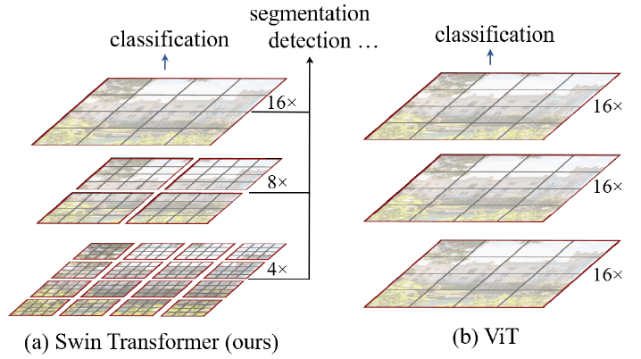
 

- [ ] **(ViT) An Image is Worth 16x16 Words: Transformers for Image Recognition at Scale [ICLR, 2021]** [[Paper]](pdfs/2010.11929.pdf)
  - Image to patch sequence (16x16) into transformer blocks
  - ViT vs CNN:
    - ViT:
      - suitable for scaling large model
      - potential of multimodel learning
      - global feature attention
    - CNN:
      - suitable for small model
      - local feature attention
  - A hybrid of CNN and ViT can be beneficial to leverage arbitrary length of attention while accelerate training with CNN's inductive bias
  - 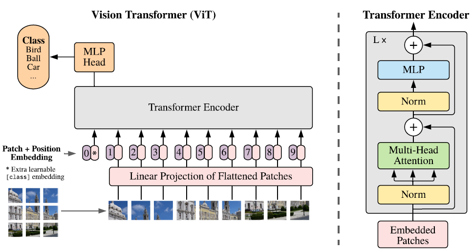
 

- [ ] **Attention Mechanisms in Computer Vision: A Survey** [[Paper]](pdfs/attention_in_cv.pdf)

 

- [x] **Attention Is All You Need** [[Paper]](pdfs/1706.03762.pdf)

 

---
### Implicit Representation

- [ ] **Plenoxels: Radiance Fields without Neural Networks [arxiv, 2021]** [[Paper]](pdfs/plenoxel.pdf)
  - NN-free grid radiance fields optimizing Spherical Harmonics

 

- [ ] **Uncertainty-Aware Radiance Fields AND Controllable Rendered Image**
  - Uncertain Randiance Field:
    - learn a ray/sample to distribution function
      - fixing camera, varying image of different ensemble runs
      - 
  - Uncertain Visualization
    - animated rendering with SAME parameter (showing uncertainty)
  - Parameter Exploration
    - animated rendering with DIFF parameter (showing paremter sensitivity)

 

- [ ] **Deep Marching Tetrahedra: a Hybrid Representation for High-Resolution 3D Shape Synthesis [NIPS, 2021]** [[Paper]](pdfs/deep-marching-tetrahedra.pdf) 
  - main idea and questions:
    - how is MT diffirentiable and more "performant" than MC

 

- [ ] **Volume Rendering of Neural Implicit Surfaces[NIPS, 2021]** [[Paper]](pdfs/Volume_Rendering_of_Neural_Implicit_Surfaces.pdf)

 

- [x] **NeRV: Neural Representations for Videos [NIPS, 2021]** [[Paper]](pdfs/NeRV_Neural_Representations_for_Videos.pdf)
  > implicit representation, f: t -> image, with conventional implicit NN architecture and a loss of (L1 + SSIM) against image

 

- [ ] **NeuS: Learning Neural Implicit Surfaces by Volume Rendering for Multi-view Reconstruction [NIPS, 2021]** [[Paper]](pdfs/NeuS_Learning_Neural_Implicit_Surfaces_by_Volume_Rendering_for_Multi-view_Reconstruction.pdf)
  > Imaged-based surface reconstruction with SDF and Volume Rendering integral

 

---

### Point Cloud

- [ ] **SP-GAN: Sphere-Guided 3D Shape Generation and Manipulation [SIGGRAPH, 2021]** [[Paper]](pdfs/2108.04476.pdf)
  - Spherical Prior to guide point cloud generation
    - (Try Spherical Folding)

- [ ] **CVPR 2021: all about self-driving**

 

- [ ] **PoinTr: Diverse Point Cloud Completion with Geometry-Aware Transformers [ICCV, 2021]** [[Paper]](pdfs/2108.08839.pdf)

 

- [ ] **A Rotation-Invariant Framework for Deep Point Cloud Analysis [TVCG, 2021]** [[Paper]](pdfs/2003.07238.pdf)

 

- [ ] **Relationship-based Point Cloud Completion [TVCG, 2021]** [[Paper]](pdfs/Relationship-based_Point_Cloud_Completion.pdf)
  - multi-object completion

 

- [ ] **Meta-PU: An Arbitrary-Scale Upsampling Network for Point Cloud [TVCG, 2021]** [[Paper]](pdfs/Meta-PU_An_Arbitrary-Scale_Upsampling_Network_for_Point_Cloud.pdf)
  > arbitrary-scale upsampling of points with Meta-learning
  - Upscale to x$R_{max}$, and then sample to desired scale
  - A meta-subnetwork predicts weights for upsampling network for customized feature for different scales, which is the input
  - 
  - 

 

- [ ] **PU-GCN: Point Cloud Upsampling using Graph Convolutional Networks [CVPR, 2021]** [[Paper]](pdfs/PU-GCN_Point_Cloud_Upsamping.pdf)
  - Related Work Shortcoming
    - PU-Net: extract point features at different downsampled levels
      - Problem: downsampling loses fine details
    - 3PU: progressive upsampling units with different # of neighborhood for different receptive field and multi-scale info
      - progressive approach makes it expensive
  - Contribution
  - NodeShuffle: 
  - Inception DenseGCN: efficient multi-scale info extraction

 

- [x] **ASHF-Net: Adaptive Sampling and Hierarchical Folding Network for Robust Point Cloud Completion [AAAI, 2021]** [[Paper]](pdfs/ASHF-Net_adaptive_sampling_heirarchical_folding_point_cloud_completion.pdf)
  - Farthest Point Sampling (FPS): widely used point sampling for shape completion
  - Adaptive Sampling (AS) module
    - A neighborhood: for a point pi and knn neighbors Pik
      - relative point position: pi and Pik position guven by concatenation of points
      - augmented feature vector: each point relative pos concat feature
      - Attention between one feature vector(Q) and all feature vector(K) computed and used to update the feature vector (V1) and central point cooridnate (V2)
  - Hierarchical Folder Decoder
    - sparse to dense 2D grid folding with Gated Skip-Attention 
      - Q: prev features concat 2D grid
      - K: Encoder latent duplicated
      - V: Encoder latent duplicated
  - 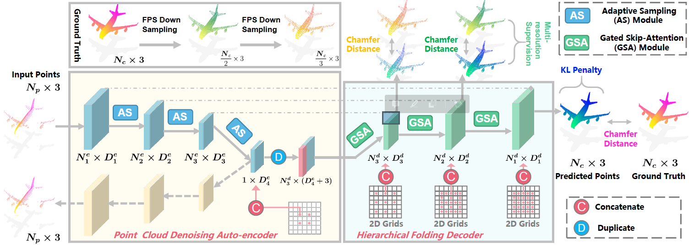
  - 
     -  Top left: how is Nd_i+1 duplicated to get Nd_i? If Nd_i+1's Dd_i+1 features are different, which of them are chosen to be duplicated?

 

- [ ] **SampleNet: Differentiable Point Cloud Sampling [CVPR, 2020]** [[Paper]](pdfs/Lang_SampleNet_Differentiable_Point_Cloud_Sampling_CVPR_2020_paper.pdf)
  - Task-specific sampling. Tackled non-differentiability of sampling in **Learn to Sample [CVPR, 2019]**.

 

- [ ] **Grid-GCN for Fast and Scalable Point Cloud Learning [CVPR, 2020]** [[Paper]](pdfs/Xu_Grid-GCN_for_Fast_and_Scalable_Point_Cloud_Learning_CVPR_2020_paper.pdf)
  - regular gridding the points and sample from grids to get both **good coverage** and **less runtime**

 

- [x] **(AR-GCN) Point Cloud Super Resolution with Adversarial Residual Graph Networks** [[Paper]](pdfs/1908.02111.pdf)
  - Contribution
    - Adversarial GCN for upsampling task with un-pooling unit
  - 
  - 
  - 
  - 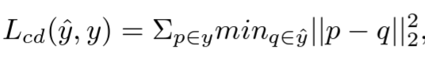
  - 
  - 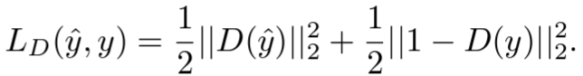
 

- [ ] **LassoNet: Deep Lasso-Selection of 3D Point Clouds [Scivis, 2019]** [[Paper]](pdfs/LassoNet_Deep_Lasso-Selection_of_3D_Point_Clouds.pdf)
  - interactive visualization is important for data exploration and understanding. Intellegient data selection/filter is desired for an interactive volume visualization system, but it is difficult to achieve because of the occlusion from 3D volume projected to 2D image. For 3D point cloud or particle lasso selection, traditional heuristics-based algorithm are based on data property. Supervised DNN once trained on labeled dataset, can produce accurate 3D data with selection on 2D image and generalize to similar dataset. For point cloud data, permutation-variant neural networks like PointNet, which is MLP with global pooling, is usually adopted.
  - Jaccard distance between selected points and target points

 

- [ ] **(DGCNN) Dynamic Graph CNN for Learning on Point Clouds [ToG, 2019]** [[Paper]](pdfs/dgcnn.pdf)
  - EdgeConv -
    - $\square$: aggregation fn;
    - $h_\theta$ edge fn;
    - g: gauss kernel;
    - u: pairwise euc dist
    - (u,v) directed edge weight (local structure): $x_v-x_u$
      - x
    $$
    \begin{align*}
    \begin{split} 
      x_i' & = \underset{j:(i,j)\in \mathscr{E}}{\square}h_\theta(x_i, x_j) \\
      (1): x_{im}' & = \sum_{j:(i,j)\in\mathscr{(E)}}\theta_m \cdot x_j \\
      (2): x_i' & = \underset{j:(i,j)\in \mathscr{E}}{\sum}h_\theta(x_i) \\
      (3): x_i' & = \underset{j:(i,j)\in \mathscr{E}}{\sum}h_\theta(x_j)g(u(x_i,x_j)) \\
      (4): x_i' & = \underset{j:(i,j)\in \mathscr{E}}{\sum}h_\theta(x_j-x_i)\\
      (5, Chosen): x_i' & = \underset{j:(i,j)\in \mathscr{E}}{\sum}h_\theta(x_i \oplus (x_j-x_i)) \\
      x_{im}' & = \underset{j:(i,j)\in\mathscr{(E)}}{max}e_{ijm}'  \\
      e_{ijm}' & = ReLU(\theta_m\cdot(x_j-x_i)+\phi_m\cdot x_i) \\
      \Theta & = (\theta_1,...,\theta_M,\phi_1,...,\phi_M)
    \end{split}
    \end{align*}
    $$
    - Properties
      - Permutation invariance: with symmetric functions
      - 

 

- [ ] **Modeling Point Clouds with Self-Attention and Gumbel Subset Sampling [CVPR, 2019]** [[Paper]](pdfs/Yang_Modeling_Point_Clouds_With_Self-Attention_and_Gumbel_Subset_Sampling_CVPR_2019_paper.pdf)
  - Gumbel Subset Sampliong (GSS)
    - task-agnostic, permutation invariant, differentiable sampling.
    - QUESTION: Why is differentiability important?
  - Group Shuffle Attention (GSA)
    - more efficient than vanilla MHA

 

- [ ] **Learning to Sample [CVPR, 2019]** [[Paper]](pdfs/Dovrat_Learning_to_Sample_CVPR_2019_paper.pdf)
  - data-driven task-specific sampling 

 

- [x] **PU-GAN: a Point Cloud Upsampling Adversarial Network [ICCV, 2019]** [[Paper]](pdfs/1907.10844.pdf)
  - Contribution
    - First to apply GAN to upsampling task. Proposed UP-DOWN-UP unit to power generator.
    - compound loss: adversarial, reconstruction, and uniform
  - Architecture
    - 
    - 
  - Loss Function

 

- [x] **PU-Net: Point Cloud Upsampling Network [CVPR, 2018]** [[Paper]](pdfs/Yu_PU-Net_Point_Cloud_CVPR_2018_paper.pdf)
  - PC super resolution challenge
    1. no spatial order and structure
    2. ~~PC should lie on object surface~~
    3. ~~should not clutter~~
     - 2,3 might not be necessary for particle data
  - **Design Intuition**:
    - learn multi-level feature (point feature embedding)
    - expand point with multi-branch conv (feature expansion)
    - joint loss encouraging uniform point placement (repulsion loss)
  - 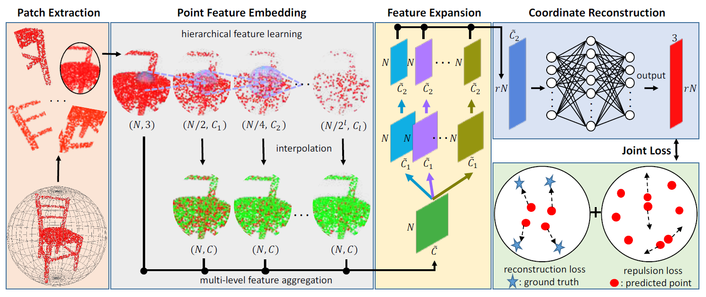
  - Point Feature Embedding
    - pointnet++ hierachical feature learner
    - For each hierachy
      - interpolate to get N points
      - 1x1 conv to get C features
  - Feature Expansion
    - concatenate (N, C)s = (N, $\hat{C}$)
    - Then *feature expansion*
      - $f'=RS([C_1^2(C_1^1(f)), ... , C_r^2(C_r^1(f))])$
        - two 1x1 conv to expand channels
        - (N, $\hat{C}$) -> (N, $r\hat{C_1}$) -> (N, $r\hat{C_2}$) -> reshape-(rN, $\hat{C_2}$)
  - Coordinate Reconstruction
    - MLP((rN, $\hat{C_2}$)) -> (rN, 3)
  - Joint Loss Function
    - reconstruction loss: EMD/CD (EMD better capture shape)
    - repulsion loss:
      - 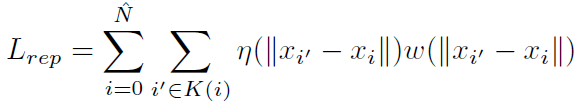
        - $\eta(r) = -r$, $w(r)=e^{-r^2/h^2}$
    - 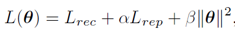

 

- [x] **PCN: Point Completion Network [3DV, 2018]** [[Paper]](pdfs/point_completion_network.pdf)
  - Entended PointNet encoder -> MLP + Folding Decoder with 2-stage up sampling
    - 1st stage: latent *v* -> coarse point cloud
    - 2nd stage: for each point *p* in coarse, upsampling by generating neigbhor points with *p*, *v* and folding
  - 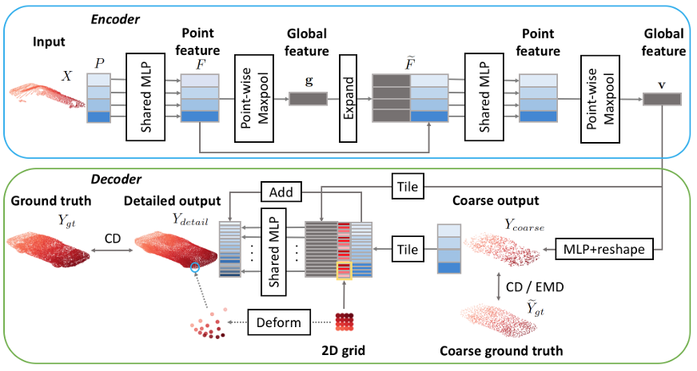

 

- [x] **VoxelContext-Net: An Octree based Framework for Point Cloud Compression [CVPR, 2021]** [[Paper]](pdfs/VoxelContext-Net_An_Octree_Based_Framework_for_Point_Cloud_Compression_CVPR_2021_paper.pdf)
  > Point Cloud -> Octree -> Occupancy Volume ->
  > Arithmetic Encoding: P(8-bit-string/tree node) learned by deep entropy NN ->
  > Arithmetic Decoding: Cooordinate Refinement: Octree Coordinate + Offset
  > Temporal learning: *local voxel context* enhanced by the *context* at same depth from previous and next point cloud, and is used in deep entropy model. (not used in coordinate refinement network). 
  - *local voxel context*: surrounding voxel in the Occupancy Volume
  - Encoding P(node) NN design:
    - take 8-bit string and the *local voxel context* (surrounding voxel in the Occupancy Volume) 
    - predict P(node), which is actually P(node | bitstring, voxel context)
  - Decoding Offset Formulation:
    - get FULL occupancy volume, find *local voxel context*, feed in a NN to get offset
    - final point position: octree coordinate + NN(voxel context)

- [ ] **Deep Learning for 3D Point Clouds: A Survey [arxiv, 2020]** [[Paper]](pdfs/dl-for-pc-survey.pdf)

 

- [x] **PointNet: Deep Learning on Point Sets for 3D Classification and Segmentation [CVPR, 2017]** [[Papers]](pdfs/pointnet.pdf)
  - permutation invariant point cloud network

 

- [ ] **PointNet++: Deep Hierarchical Feature Learning on Point Sets in a Metric Space [NIPS, 2017]** [[Paper]](pdfs/pointnet++.pdf)
  - hierachical PointNet

 

- [ ] **PointCNN: Convolution On X-Transformed Points [NIPS, 2018]** [[Paper]](pdfs/pointcnn.pdf)

 

- [x] **FoldingNet: Point Cloud Auto-encoder via Deep Grid Deformation [CVPR, 2018]** [[Paper]](pdfs/1712.07262.pdf)
  - **Intuition**
    - the 2D coordinate differentiate the replicated latent to avoid reconstruction collapses to same coordinates
      - when decoding, latent is replicated and then transoformed. Without the coordinate, empirically the reconstruction will be replications of points (all points collapsing to the same value).
      - TO BE SHOWN: folding avoids the above problem, by Sformer experiment.
  - Encoder: Graph-based encoder (with permutaiton invariant proof)
  - Decoder: 
    - input/output: latent + 2D coordinate -> 3D Point Coordinate
    - Architecture: 
      - intput: latent + 2D Grid -> input
      - **Foldings**:
        - 1st folding (MLP): input -> intermediate point cloud
        - 2nd folding (MLP): latent + intermediate point cloud -> final point cloud
      - output: final point cloud

 

- [x] **TearingNet: Point Cloud Autoencoder to Learn Topology-Friendly Representations** [[Paper]](pdfs/tearingnet.pdf)
  - Intuition: By "tearing" (i.e. modifying the 2D Grid preped for *folding*) can facilitate topology property (i.e. connectivity) learning for PC reconstruction
  - Encoder: Graph-based encoder 
  - Decoder:
    - input/output: latent + 2D coordinate -> 3D Point Coordinate
    - Architecture: 
      - intput: latent + 2D Grid -> input
      - Fold-**Tear**-Fold (F-T-F):
        - Folding (MLP): input -> intermediate point cloud
        - **Tearing** (MLP): latent + 2D Grid + intermediate point cloud -> 2D Grid Updating Residual
        - Final Folding (MLP): latent + Updated 2D Grid -> final point cloud
      - output: final point cloud
      - note: (F-T before Final Folding can be repreated like F-T-**F-T-F-T**-F for iterative 2D Grid update)

 

---

### Autoencoder

- [ ] **Masked Autoencoders Are Scalable Vision Learners** [[Paper]](pdfs/masked_ae_scalable_vision_learner.pdf)

 

- [ ] **Multiscale Mesh Deformation Component Analysis with Attention-based Autoencoders [TVCG, 2021]** [[Paper]](pdfs/Multiscale_Mesh_Deformation_Component_Analysis_with_Attention-based_Autoencoders.pdf)

 

- [ ] **Recent Advances in Autoencoder-Based Representation Learning [NIPS, 2018]** [[Paper]](pdfs/vae_rep_learning_2018.pdf)

---

### Generative Model

- [ ] **Deep Generative Modelling: A Comparative Review of VAEs, GANs, Normalizing Flows, Energy-Based and Autoregressive Models [TPAMI, 2021]**[[Paper]](pdfs/2103.04922.pdf)

 

- [ ] **Deep Generative Models: Survey [ISCV, 2018]** [[Paper]](pdfs/Deep_generative_models_Survey.pdf)

 

#### GAN

 

- [ ] **A Review on Generative Adversarial Networks: Algorithms, Theory, and Applications [TKDE, 2021]** [[Paper]](pdfs/A_Review_on_Generative_Adversarial_Networks_Algorithms_Theory_and_Applications.pdf)

 

- [ ] **On GANs and GMMs [NIPS, 2018]**
  - Training a extreme-scale dimensional GMM

 

#### Normalizing Flow

 

- [ ] **Normalizing Flows for Probabilistic Modeling and Inference [JMLR, 2021]** [[Paper]](pdfs/19-1028.pdf)

 

- [ ] **Normalizing Flows: An Introduction and Review of Current Methods [IPAMI, 2020]** [[Paper]](pdfs/1908.09257.pdf)

 

#### Energy-Based Models

 

- [ ] **How to Train Your Energy-Based Models [arxiv, 2020]** [[Paper]](pdfs/2101.03288.pdf)

 

#### VAE

 

- [ ] **A survey on Variational Autoencoders from a GreenAI perspective [arxiv, 2021]** [[Paper]](pdfs/2103.01071.pdf)

 

- [ ] **Dynamical Variational Autoencoders: A Comprehensive Review [arxiv, 2020]** [[Paper]](pdfs/2008.12595.pdf)
  - Temporal VAE: handles sequence dependency

 

- [ ] **An Introduction to Variantional Autoencoders [Foundations and Trends in ML, 2019]** [[Paper]](pdfs/1906.02691.pdf)

 

- [ ] **Mixture Density Network [Classics, 1994]** Christopher M. Bishop [[Paper]](pdfs/NCRG_94_004.pdf)
  - Question:
    - Difference between EM on GMM?
      - MDN provides conditional pdf: $P(y|x)=\sum_if_\alpha(x) N(f_\mu(x),f_\sigma(x))$
    - softmax and exponential term theoretical interpretation
      - softmax for component prior: sum to one
      - sigma = exp(z): un-informative Bayesian prior, assuming z has uniform distribution; avoid variance goes to 0

- **Question: GMM vs KDE?**
  - is GMM a simplified KDE with fewer components?
  - No:
    - KDE: each data point represent a distribution
    - GMM: data points conform to a predefined mixture of components

 

- **Review: EM algorithm**
  - Problem:
    - Assumethere is an unknown statistical model with some parameters $\theta$, from which some observations $X=(x_1,...,x_n)$ are generated. Want to find the model by maximizing the likehood of the parameter given observations $P(\theta;X) = \prod_iP(\theta;x_i)$    - 
      - max this is equivalent to max the log form, which is by setting the derivative to 0:
      - $logP(\theta;X) = \sum_ilogP(\theta;x_i)$
        - **Now: No analytical solution. How to maximize?**
          - introduce hidden indicator variable $Z$ mapping $x_i$ to its membered component. Then can, for each member, get MLE of parameters
          - $Z$ unknown, and EM goes in and estimate E, then use E to update param, then estimate E again, then ...... until convergence
  - Expectation-Maximization Algorithm for GMM
    - GMM pdf: $p(x)=\sum_i^k\alpha_iN(x;\mu_i,\sigma_i)$
    - Expectation: approximate $Z$ (i.e. $\alpha$s) with observation and current parameters:
      - $P(\alpha_i|x_j)=\alpha_{norm}P(x_j|\alpha_i)P(\alpha_i)$
        - $P(x_j|\alpha_i)$ is $N(\mu_i,\sigma_i)$ in GMM optimization
        - under perfect indicator assumption $P(\alpha_i|x_j)$ should be 1, but we can only approximate
    - Maximization (MLE with $P(x_j|\alpha_i)$):
      - Define $N_i=\sum_jP(\alpha_i|x_j)$
        - intuitively for an indicator function Z (which we can only appximate), it's the number of observations in this component
      - $\mu_i=\frac{1}{N_i}\sum_jx_jP(\alpha_i|x_j)$
      - $\sigma_i^2=\frac{1}{N_i}\sum_j(x_j-\mu_i)^2P(\alpha_i|x_j)$
      - $\alpha_i=\frac{N_i}{\sum_jN_j}$
    - Goes back to Expectation and update our approximated $Z$ and then update parameters with new Z, iteratively.

 

---

### Uncertainty Quantification

- [ ] **Basic Framework and Main Methods of Uncertainty Quantification [arxiv, 2020]** [[Paper]](pdfs/6068203.pdf)

 

- [ ] **A Review of Uncertainty Quantification in Deep Learning: Techniques, Applications and Challenges [arxiv, 2020]** [[Paper]](pdfs/UQ_in_DL_survey.pdf)

 

---

### Image

- [ ] **GAN-Control: Explicitly Controllable GANs [arxiv, 2021]** Amazon One [[Paper]](pdfs/gan-control.pdf)

 

- [x] **Meta-SR: A Magnification-Arbitrary Network for Super-Resolution [CVPR, 2019]** [[Paper]](pdfs/meta-sr.pdf)
  - Gnerate high res pixel 1 by 1 with scale-aware weights (meta-learning) for arbitrary scale super resolution
  - 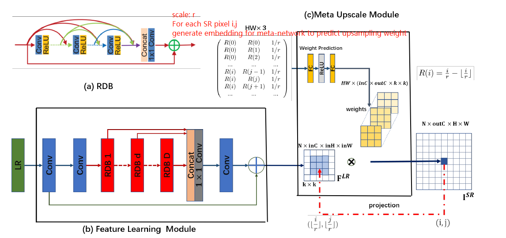
  - 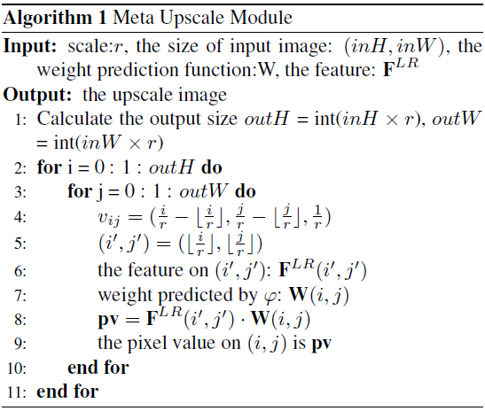
  - 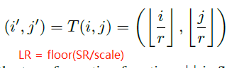
  - 

---

### NN Optimization and Theory

- [ ] **Early Convolutions Help Transformers See Better [2021]** [[Paper]](pdfs/Early-Convolutions-Help-Transformers-See-Better.pdf)
  - **early CNN layer helps Transformer opitmization**
    - robust to **hyperparameter** (lr and wd choice)
    - **converge** quickly
    - works with AdamW, and **SGD**
    - outperforms SOTA CNN
  - 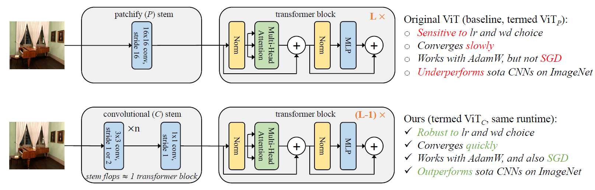

 

- [ ] **A Metric Learning Reality Check [arxiv, 2020]** [[Paper]](pdfs/metric-learning-reality-check.pdf)

 

- [ ] **On the Spectral Bias of Neural Networks [ICML, 2019]** (Yoshua Bengio group) [[Paper]](pdfs/spectral-bias-dl.pdf)

 

- [ ] **Bag of Tricks for Image Classification with Convolutional Neural Networks [arxiv, 2018]** Mu Li, AWS [[Paper]](pdfs/bad-of-tricks-cv-training.pdf)
  - Training Image Preprocessing
    - get an image and decode to 32-bit
    - randomly crop
    - 0.5 chance flip honrizontally
    - scale hue, satruation, brightness with coefficients [0.6, 1.4]
    - PCA noise coefficient from N(0, 0.1)
    - normalize RGB by subtracting 123.68, 116.779, 103.939 and dividing yb 58.393, 57.12, 57.375

 

- [ ] **Relational inductive biases, deep learning, and graph networks [arxiv, 2018]** DeepMind, Google Brain, MIT, U of Edinburgh [[Paper]](pdfs/indictive-biases-dl.pdf)

 

- [ ] **Model Evaluation, Model Selection, and Algorithm Selection in Machine Learning [arxiv, 2018]** [[Paper]](pdfs/1811.12808.pdf)

---

## Computer Graphics
### Path Tracing: Denoising
- [ ] **Weakly-Supervised Contrastive Learning in Path Manifold for Monte Carlo Image Reconstruction [SIGRAPH, 2021]** [[Website]](https://www.notion.so/iycho/Weakly-Supervised-Contrastive-Learning-in-Path-Manifold-for-Monte-Carlo-Image-Reconstruction-d3f58f37e33b491d8fdaef43814c3a3c)

 

### Path Tracing: Path Guiding
- [ ] **Hierarchical Neural Reconstruction for Path Guiding Using Hybrid Path and Photon Samples [SIGGRAPH, 2021]** [[Paper]](pdfs/shilinsig21.pdf)

 

### Mipmaping
- [ ] **NeuMIP: Multi-Resolution Neural Materials [SIGGRAPH, 2021]** [[Paper]](pdfs/neumip_final.pdf)

 

---
## Other Topics

- [ ] **Full Transport General Relativistic Radiation Magnetohydrodynamics for Nucleosynthesis in Collapsars [arxiv, 2020]** [[Paper]](pdfs/1912.03378.pdf)

 

- [x] **Bigtable: A Distributed Storage System for Structured Data [2006]** Google [[Paper]](pdfs/bigtable-osdi06.pdf)
  > Bigtable: sparse, distributed, persistent multi-dimensional sorted map:
  > (row:string, column:string, time:int64) -> string (uninterpreted bytes)
  - row:
    - up to 64KB string, usually 10-100 bytes
    - read/write of row are atomic
      - ease of reasoning concurrent updates
    - row range dynamically partitioned; sorted lexicographically
      - efficient reads of short row ranges
      - can exploit locality with similar lexicographic ordered strings and their row ranges stored near each other
  - column:
    - grouped into *column families*: basic unit of access control and disk memory accounting
      - naming: *family:qualifier*
        - ex: in Webtable, anchor:[name of referring site]
      - expect # of distinct families to be small and families rarely change while columns do 
  - timestamp:
    - 64-bit integer
    - different versions of cell stored in decreasing timestamp order
  - Infrastructure
    - distributed Google File System
    - *SSTable* file format
      - persistent ordered immutable map
      - a sequence of blocks with block index for single disk seek lookup
    - distributed lock service: Chubby
      - 5 replicas. 1 elected master and serve request
      - Paxos algorithm for replica consistency in failure
      - Used for
        - ensure at most one active master
        - store bootstrap location of Bigtable data
        - discover tablet servers and finalize tablet server deaths
        - store Bigtable schema information
        - store access control list
  - Implementation
    - 3 components:
      - library linking every client
      - one master server
        - management of tablet servers; GFS garbage collection
      - many tablet servers
        - each manages a set of tablets: read/write/split