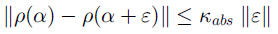
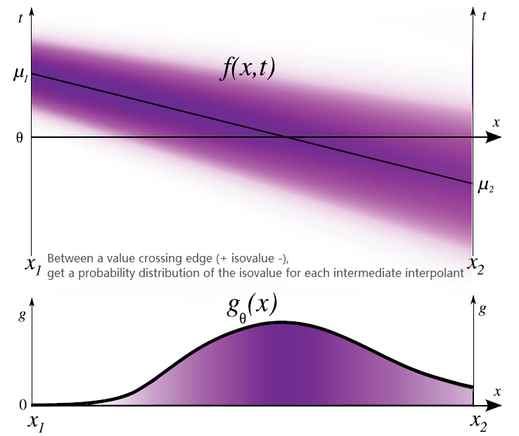
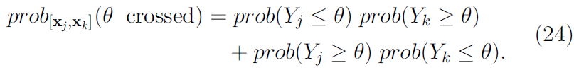
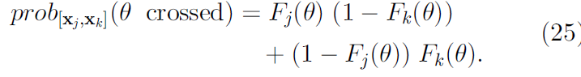
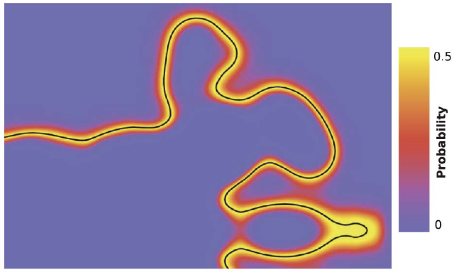
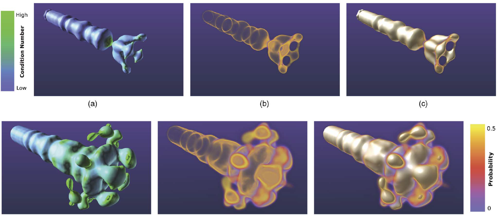
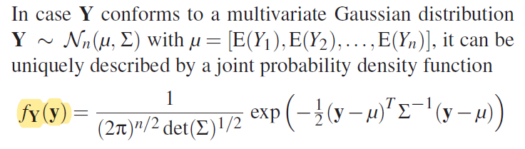
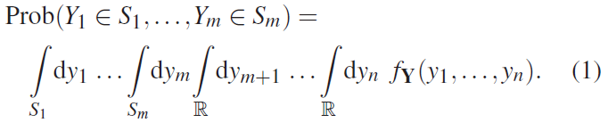
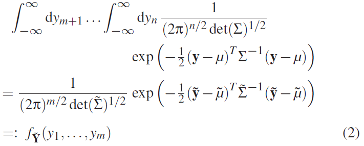
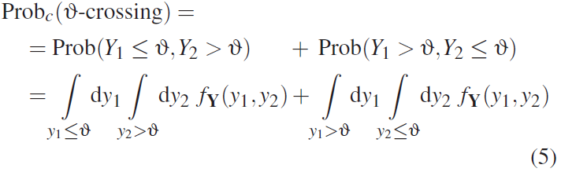

- [x] **Positional Uncertainty of Isocontours: Condition Analysis and Probabilistic Measures [TVCG, 2010]** K. Pothkow and H. Hege [[Paper]](pdfs/Positional_Uncertainty_of_Isocontours_Condition_Analysis_and_Probabilistic_Measures.pdf)
  - Uncertainty in Physical Measurements: significant random errors
    - Systematic Errors: "An error that always occurs in the same way and extent if a measurement of some quantity is repeated
      - calibration deficits, environmental conditions, too simple measured quantity models
    - Random Errors
      - interference of environment, noises, etc.
    - Other uncertainty sources
      - precision, quantization, discretization
  - **CONFUSED: Numerical Condition**
    - *Condition: The effect of uncertainty of input data ($\alpha$) on output quantiy $(\rho(\alpha))$*
      - e.g. uncertain scalar field -> isocontour
    - *Condition Number: Sensitivity of an output for a given problem to uncertainty of input data (independant of algorithm of uncertainty types).*
    - *Absolute Normiwise Condition*: $\kappa_{abs} = || \nabla_\alpha\rho(\alpha) ||$
      - 
    - *Well/Ill-Conditioned*
      - $\kappa_{abs}$ low: well-conditioned
      - $\kappa_{abs}$ high: ill-conditioned
      - low/high definition is problem-dependent
  - *Well and Ill-Conditioned Isocontours*
    - **low gradient -> ill-conditioned because the value change is small -> sensitive to noise/prone to error**
    - used in isocontour extraction threshold selection
  - Uncertain scalar field as Gaussian field
    - interpolant Gaussian from interpolating $\mu$ and v
  - **Isocontour Density**
    - $\theta$: isovalue, $x$: interpolated gaussian parameters
    - $g_\theta(x)=\frac{1}{\sigma(x)\sqrt{2\pi}}exp(-\frac{1}{2}(\frac{\theta-\mu(x)}{\sigma(x)})^2)$
      - intuitively: probability of the isovalue under this interpolated pdf
    - 
  - **Level-Crossing Probability** Field
    - LCP of a cell is calculated as sum of Isocontour configurations' probability:
    - max=0.5
      \
      With CDF (Gaussian used):\
    
    - Cells can be subdivided by Interpolation on Gaussians vertices
    - 2D LCP field visualized as heatmap

      
    - 3D LCP field volume rendered
    
      

 

- [x] **Probabilistic Marching Cubes [EuroVis, 2011]** Kai Pöthkow,Britta Weber,Hans-Christian Hege [[Paper]](pdfs/probabilistic_marching_cubes.pdf)
  - Symbols and Notations
    - Y: data values; x: sample locations
  - Spatial Correlation in consideration:
    - Uncertain scalar field as Multivariate Gaussian field, each grid point is a Gaussian.
    - To calculate pdf involving certain points, need to marginalize out others.
      - for MV Gaussan, margialization of variables is done by taking out of their $\mu$ and $\Sigma$ associated
        - Therefore, with a field-level MV gaussian, LCP only needs joint pdf of the vertices in cell
      - 
    - Level Set Probability
      - 
    - Level Set Probability - Margnilization of m+1,...,n with Gaussian
      - 
    - Level Set Proability in uncertain 1D field (line segments)
      - 
  - reading questions: how's the morse/non-morse function affects the probabilistic marching cube?
  - level crossing probability calculated with multivariate gaussian pdf
  - Discussion:
    - higher spatial correlation reduces level crossing probability (reduces uncertain Isosurface)
 