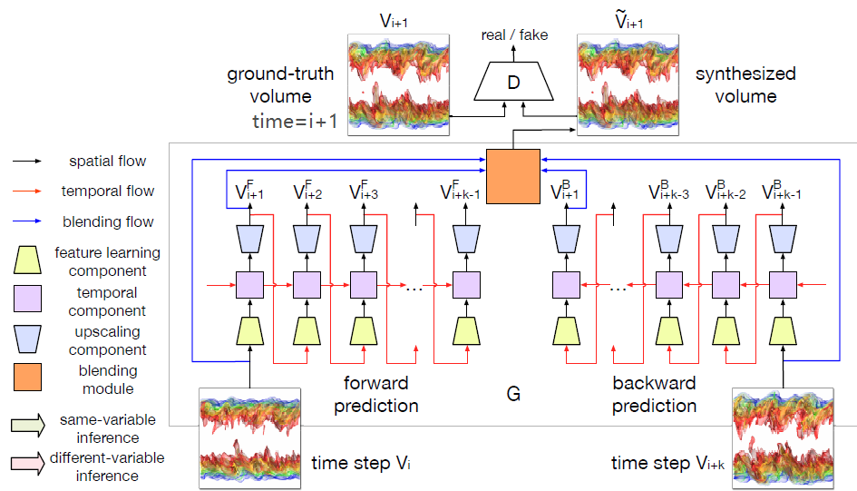
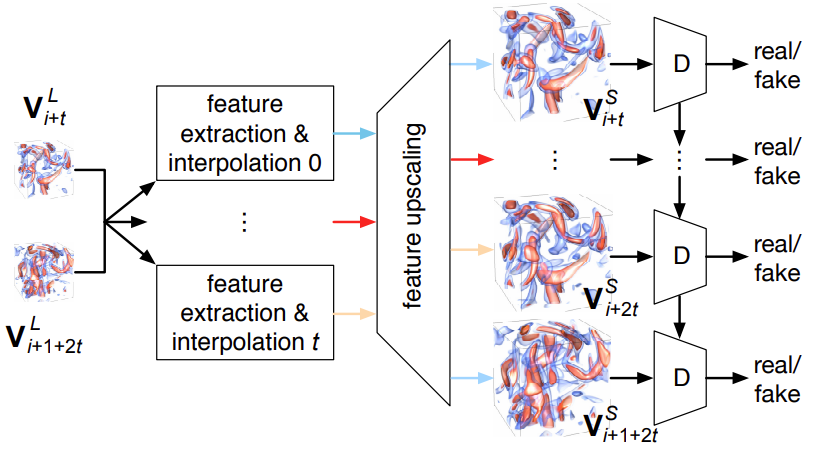
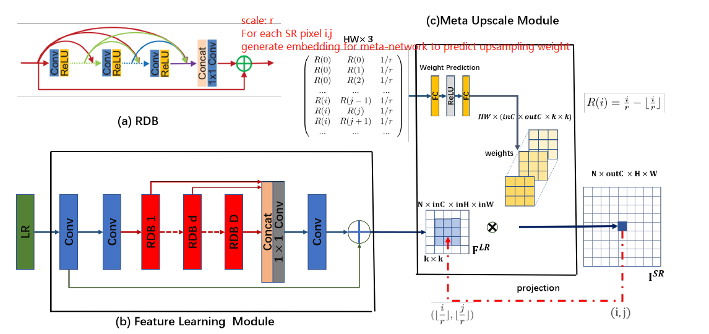
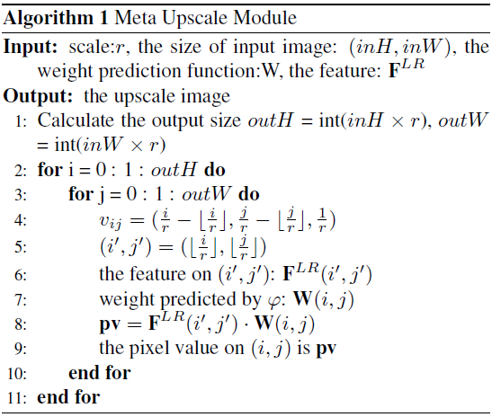
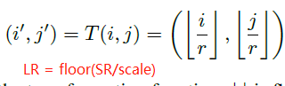
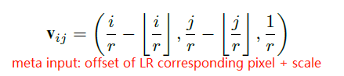

- [Back](#back)
  - [Data Reduction Methods](#data-reduction-methods)
  - [Data Reduction](#data-reduction)
  - [Super Resolution](#super-resolution)

## [Back](README.md)

 

### Data Reduction Methods

| Reduction Method | Pipeline | Compression Ratio | Benefits | Drawbacks | 
| ---              | ---      | ---               | --- | --- |
| Compression         | encode- > **bitstream storage** -> decode | high (TThresh) |
| Deep Super Resolution    | **LR+model storage** -> decode(SR) | low?
| Statistical Summary | **model storage** -> decode(sampling) | medium (beat SZ)
| importance sampling | **sample storage** -> decode(lerp, SR, ...) | ?

### Data Reduction

- [ ] **A Multi-branch Decoder Network Approach toAdaptive Temporal Data Selection andReconstruction for Big Scientific Simulation Data [BigData, 2021]** [[Paper]](pdfs/A_Multi-branch_Decoder_Network_Approach_toAdaptive_Temporal_Data_Selection_andReconstruction_for_Big_Scientific_Simulation_Data.pdf)

 

- [ ] **High-quality and Low-memory footprint Progressive Decoding of Large-scale Particle Data [LDAV, 2021]** [[Paper]](pdfs/High-quality_and_Low-memory-footprint_Progressive_Decoding_of_Large-scale_Particle_Data.pdf)

 

- [ ] **V2V: A Deep Learning Approach to Variable-to-Variable Selection and Translation for Multivariate Time-Varying Data [TVCG, 2021]** [[Paper]](pdfs/V2V_A_Deep_Learning_Approach_to_Variable-to-Variable_Selection_and_Translation_for_Multivariate_Time-Varying_Data.pdf)
  - A U-Net (Conv, Deconv, skip connection) is used to learn the feature of different variables, and then the distance between variable features is calculated with Kullback-Leibler divergence.

 

- [ ] **Probabilistic Data-Driven Sampling via Multi-Criteria Importance Analysis** A. Biswas, S. Dutta, E. Lawrence, J. Patchett, J. C. Calhoun and J. Ahrens [[Paper]](pdfs/Probabilistic_Data-Driven_Sampling_via_Multi-Criteria_Importance_Analysis.pdf)

 

- [x] **Distribution-based Particle Data Reduction for In-situ Analysis and Visualization of Large-scale N-body Cosmological Simulations [Pvis, 2020]**, G. Li et al. [[Paper]](pdfs/guan-li-2020-particle-reduction-distribution-n-body-cosmology.pdf)
  > Data reduction by fitting GMM (# components estimated from trials) to the k-d partitioned large-scale particle domain. leaf GMM refined until hitting a desired # of leaves. Data reconstructed post-hoc Monte Carlo.
  - two-stage spliting (1. coarse stage: [0,1]*F GMM/leaf; 2. refinement stage: F leaves)
    - 1st stage: for particle load balance
      - F # of tree nodes, T $\in$ [0, 1]  -> T*F subspaces total
      - Select leaf with most particles to partition. Partition along highest *variance* dimension on *mean* value.
    - 2nd stage: refine for distribution quality
      - spliting leaves until hitting F total # of leaves
      - split the leave with lowest *score*
        - $p_\theta(x)=\sum\limits_{i=1}^{K}\omega_i*N(\mu_i,\sigma_i)$ -> sum of probability $x$ coming from each component
        - $L(\theta|x1,...,x_n)=\prod\limits_{j=1}^{n}p_\theta(x_j)$: likelyhood of observation coming from this GMM
        - $Score:L/N$ normalized likelihood
    - Importance of T:
      - More leaves in 1st stage (larger T) -> less quality & better runtime. Vice versa.
  - Selection of # of components:
    - $AIC=2k-2ln(L(\theta|x))$ (Akaike Information Criterion)
    - $eAIC = 2k*n-\sum\limits_{i=1}^{n}2ln(L(\theta|x))$
    - fit GMM with different # of components on dataset and select the one with lowest eAIC
  - Reconstruct particle with GMM + MC sampling
  - Evaluation: 
    - physics criterion (power spectrum & halo mass function) error low, meeting domain expert's demand.
    - visualization error low
  - Future Work: visualize GMM directly non-MC (computation efficiency)
   

  > Takeaways:
  > - KDE (to get high-qual), histogram (for multidimensional) has high storage cost

 

- [ ] **CoDDA: A Flexible Copula-based Distribution Driven Analysis Framework for Large-Scale Multivariate Data [TVCG, 2019]**, S. Hazarika, S. Dutta, H. Shen and J. Chen [[Paper]](pdfs/CoDDA_A_Flexible_Copula-based_Distribution_Driven_Analysis_Framework_for_Large-Scale_Multivariate_Data.pdf)
  > A mutivariate distribution framework avoiding exponential storage cost using the Copula function
  - Copula Function/Copula:
    - multivariate CDF whose univariate margianls are uniform distribution
    - Sklar's Theorem: every joint CDF in $R^d$ implicitly consists of a d-dimensional copula function
    $$
    \begin{align}
    \begin{split} \tag{1}
    F(x_1, x_2...x_d) & = C(F_1(x_1), F_2(x_2)...F_d(x_d)) \\
                      & = C(u_1, u_2...u_d) \quad (using F_i(x_i) = u_i \sim U[0,1])
    \end{split}
    \end{align}
    $$
    $$
    \begin{align}
    \begin{split} \tag{2}
    f(x_1, x_2...x_d) & = (F_1(x_1), F_2(x_2)...F_d(x_d)) \prod_{i=1}^d f_i(x_i)\\
                      & = c(u_1, u_2...u_d) \\
                      & = \frac{\partial C(u_1...u_d)}{\partial u_1...\partial u_d}
    \end{split}
    \end{align}
    $$
      - Implication from formula, need:
        - a) univariate CDFs $F_i$
        - b) corresponding Copula $C(u_1...u_i)$
          - use Gaussian copula, derived from standard multivariate normal
            - *good for data reduction for only storing correlation matrix (?)*
      - *Gaussian Copula*
        - s
    - 2-stage
      - Univariate Distribution Estimation
      - Dependency Modelling

  > Takeaways
  > - univariate marignal CDF: marginalize all other variables and keep only one variable to compute CDF
  
 

- [x] **Statistical Super Resolution for Data Analysis and Visualization of Large Scale Cosmological Simulations [Pvis, 2019]**, K. -C. Wang, J. Xu, J. Woodring and H. -W. Shen [[Paper]](pdfs/Statistical_Super_Resolution_for_Data_Analysis_and_Visualization_of_Large_Scale_Cosmological_Simulations.pdf)
  > Data Reduction by summarizing blocks of regular grid volume as GMM, and reconstruct the high-res volume with GMM sampling + location dictionary feature vector matching (computed from *prior simulations*)
  - Mapping GMM samples to high-res locations
    - feature vector $f_h$ of block *h* composed of stat moments of $\mu,\sigma$ of self and neighbour blocks
    - spatial info look-up table: $f_h$ -> $s_i$ mapping feature of block *h* to location *i*
    - in *prior* runs, calculate the *Cross Reconstruction Error* (CE):
      - data block $h_i, h_j$; data samples $U_{h_i}, U_{h_j}$; location info $s_{h_i}, s_{h_j}$
      - $recon(h_i, h_j)=recontructed\ h_i\ with\ U_{h_i}\ with\ s_{h_j}$
      - $CE(h_i,h_j)=\frac{NormRMSE(h_i, recon(h_i, h_j)) + NormRMSE(h_j, recon(h_j, h_i))}{2}$
    - Then, optimize a distance metric in feature space (with $f_h$) to approximate CE
      - minimize $\sum\limits_{i=0}^{N}\sum\limits_{j=i}^{N}(D(f_{h_i}, f_{h_j}) - CE(h_i, h_j))^2$

    - **Question: How come this is super-res? The down-sampled data is in a form of distribution, not the actual low-res data**
   
  > Takeaways:
  > - In data reduction with GMM, sample location consideration is non-trivial, and there seems to be room for improvement or reduction/super-res methods that work with location information directly.

 

- [ ] **Image and Distribution Based Volume Rendering for Large Data Sets [Pvis, 2018]** [[Paper]](pdfs/Image_and_Distribution_Based_Volume_Rendering_for_Large_Data_Sets.pdf)

 

- [x] **Ray-Based Exploration of Large Time-Varying Volume Data Using Per-Ray Proxy Distributions [TVCG, 2020]**, K. -C. Wang, T. -H. Wei, N. Shareef and H. -W. Shen [[Paper]](pdfs/Ray-Based_Exploration_of_Large_Time-Varying_Volume_Data_Using_Per-Ray_Proxy_Distributions.pdf)
  > For a single view, summarize each pixel ray with value histogram and depth info (location of samples). Reconstruction done based on hist and depth and custome TF. Temporal coherence checked by recontructed RMSE between t and lerp(t_prev, t_next), if error low then just use lerp to save reconstruction
  - Temporal Reduce by Exploiting Coherency
    - for non-sampled TS, cast ray and compare with interpolant between 2 sampled TS. If error small then use interpolation, else save sampled ray.

   

  > Takeaways
  > - Data Reduction for spatial-temporal data: 1. compression 2. distribution summary

 

- [ ] **Homogeneity guided probabilistic data summaries for analysis and visualization of large-scale data sets [Pvis, 2017]** [[Paper]](pdfs/Homogeneity_guided_probabilistic_data_summaries_for_analysis_and_visualization_of_large-scale_data_sets.pdf)
  > partition volume with SLIC (Simple Linear Iterative Clustering) to achieve region homogeneity s.t. more compact statistical summary can be used
  - Storage
    - Regular Grid
      - botoom front left, top back right corner
    - K-D Partition
      - id of corners of each bounding box

 

- [ ] **Statistical Visualization and Analysis of Large Data Using a Value-based Spatial Distribution [Pvis, 2017]** [[Paper]](pdfs/Statistical_visualization_and_analysis_of_large_data_using_a_value-based_spatial_distribution.pdf)

 

- [ ] **In Situ Distribution Guided Analysis and Visualization of Transonic Jet Engine Simulations [SciVis, 2016]** [[Paper]](pdfs/In_Situ_Distribution_Guided_Analysis_and_Visualization_of_Transonic_Jet_Engine_Simulations.pdf)
  > in-situ block-wise incremental GMM to summarize data. Local anomoly detecte in spatial and temporal dimension based on expected GMM and EMD similarity. Overview for anamoly analysis via Superimposed comparative charts.
  - Block-wise incremental GMM (Algorithm: *Adaptive background mixture models for real-time tracking*):
    - enables in-situ GMM estimation
  - Anamoly Detection
    - Spatial Detection:
      - Over all block, compute *expected* GMM , check for outlier Block GMM with EMD
    - Temporal Detection
      - Problem: overtime anamoly might dominate and spatial detection method would fail.
      - Solution: Over time for 1 block, compute change in its GMM to define temporal anamoly

 

---

### Super Resolution

 

- [x] **SSR-TVD [TVCG, 2020]** [[Paper]](pdfs/ssr_tvd.pdf)
  > Conv GAN takes inputs of a sequence of low-res volume and predicts high-res volume

  

- [x] **TSR-TVD [TVCG, 2019]** [[Paper]](pdfs/tsr_tvd.pdf)
  > Recurrent Conv GAN takes input of low-res volume at start and end timestep, and predict high-res volume including intermediate ones

  

- [x] **STNET [Vis, 2021]** [[Paper]](pdfs/stnet.pdf)
  > input-output TSR-TVD: (V_start, V_end) -> (V_start, V_middles... , V_end) with a feature interpolation step before upscaling

  

- [ ] **SSR-FVD [Pvis, 2020]** [[Paper]](pdfs/ssr_vfd.pdf)

- [x] **Meta-SR: A Magnification-Arbitrary Network for Super-Resolution [CVPR, 2019]** [[Paper]](pdfs/meta-sr.pdf)
  - Gnerate high res pixel 1 by 1 with scale-aware weights (meta-learning) for arbitrary scale super resolution
  - 
  - 
  - 
  - 

---