## [Back](README.md)

 

### Point Cloud

 

- [ ] **SP-GAN: Sphere-Guided 3D Shape Generation and Manipulation [SIGGRAPH, 2021]** [[Paper]](pdfs/2108.04476.pdf)
  - Spherical Prior to guide point cloud generation
    - (Try Spherical Folding)

- [ ] **CVPR 2021: all about self-driving**

 

- [ ] **PoinTr: Diverse Point Cloud Completion with Geometry-Aware Transformers [ICCV, 2021]** [[Paper]](pdfs/2108.08839.pdf)

 

- [ ] **A Rotation-Invariant Framework for Deep Point Cloud Analysis [TVCG, 2021]** [[Paper]](pdfs/2003.07238.pdf)

 

- [ ] **Relationship-based Point Cloud Completion [TVCG, 2021]** [[Paper]](pdfs/Relationship-based_Point_Cloud_Completion.pdf)
  - multi-object completion

 

- [ ] **Meta-PU: An Arbitrary-Scale Upsampling Network for Point Cloud [TVCG, 2021]** [[Paper]](pdfs/Meta-PU_An_Arbitrary-Scale_Upsampling_Network_for_Point_Cloud.pdf)
  > arbitrary-scale upsampling of points with Meta-learning
  - Upscale to x$R_{max}$, and then sample to desired scale
  - A meta-subnetwork predicts weights for upsampling network for customized feature for different scales, which is the input
  - 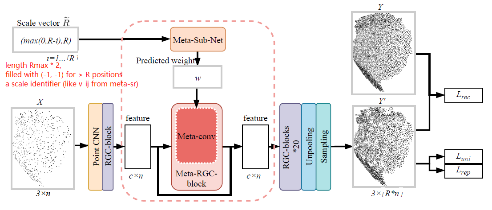
  - 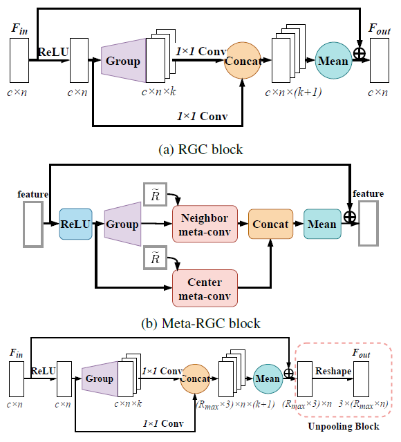

 

- [ ] **PU-GCN: Point Cloud Upsampling using Graph Convolutional Networks [CVPR, 2021]** [[Paper]](pdfs/PU-GCN_Point_Cloud_Upsamping.pdf)
  - Related Work Shortcoming
    - PU-Net: extract point features at different downsampled levels
      - Problem: downsampling loses fine details
    - 3PU: progressive upsampling units with different # of neighborhood for different receptive field and multi-scale info
      - progressive approach makes it expensive
  - Contribution
  - NodeShuffle: 
  - Inception DenseGCN: efficient multi-scale info extraction

 

- [x] **ASHF-Net: Adaptive Sampling and Hierarchical Folding Network for Robust Point Cloud Completion [AAAI, 2021]** [[Paper]](pdfs/ASHF-Net_adaptive_sampling_heirarchical_folding_point_cloud_completion.pdf)
  - Farthest Point Sampling (FPS): widely used point sampling for shape completion
  - Adaptive Sampling (AS) module
    - A neighborhood: for a point pi and knn neighbors Pik
      - relative point position: pi and Pik position guven by concatenation of points
      - augmented feature vector: each point relative pos concat feature
      - Attention between one feature vector(Q) and all feature vector(K) computed and used to update the feature vector (V1) and central point cooridnate (V2)
  - Hierarchical Folder Decoder
    - sparse to dense 2D grid folding with Gated Skip-Attention 
      - Q: prev features concat 2D grid
      - K: Encoder latent duplicated
      - V: Encoder latent duplicated
  - 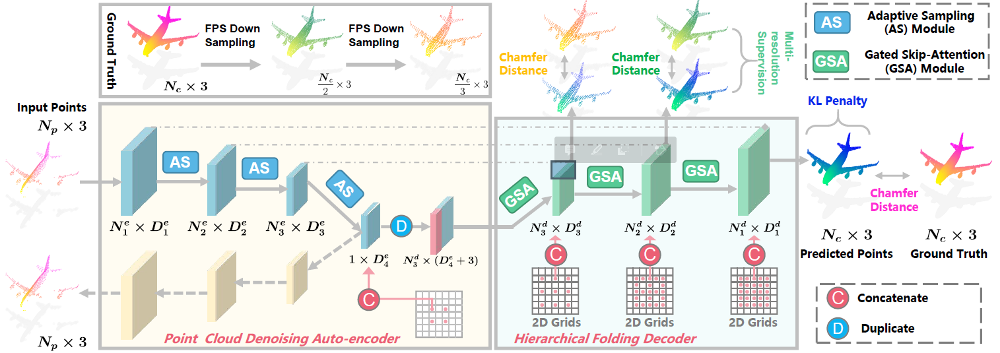
  - 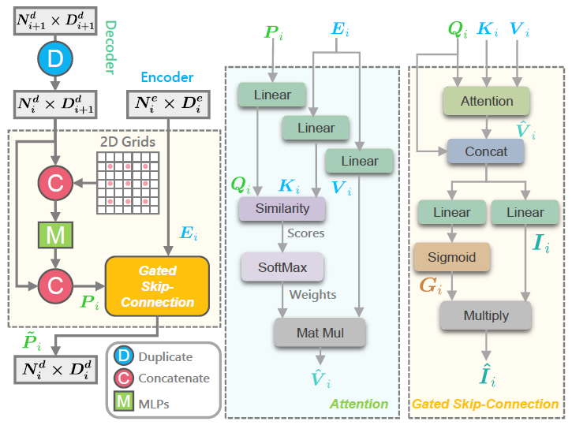
     -  Top left: how is Nd_i+1 duplicated to get Nd_i? If Nd_i+1's Dd_i+1 features are different, which of them are chosen to be duplicated?

 

- [ ] **SampleNet: Differentiable Point Cloud Sampling [CVPR, 2020]** [[Paper]](pdfs/Lang_SampleNet_Differentiable_Point_Cloud_Sampling_CVPR_2020_paper.pdf)
  - Task-specific sampling. Tackled non-differentiability of sampling in **Learn to Sample [CVPR, 2019]**.

 

- [ ] **Grid-GCN for Fast and Scalable Point Cloud Learning [CVPR, 2020]** [[Paper]](pdfs/Xu_Grid-GCN_for_Fast_and_Scalable_Point_Cloud_Learning_CVPR_2020_paper.pdf)
  - regular gridding the points and sample from grids to get both **good coverage** and **less runtime**

 

- [x] **(AR-GCN) Point Cloud Super Resolution with Adversarial Residual Graph Networks** [[Paper]](pdfs/1908.02111.pdf)
  - Contribution
    - Adversarial GCN for upsampling task with un-pooling unit
  - 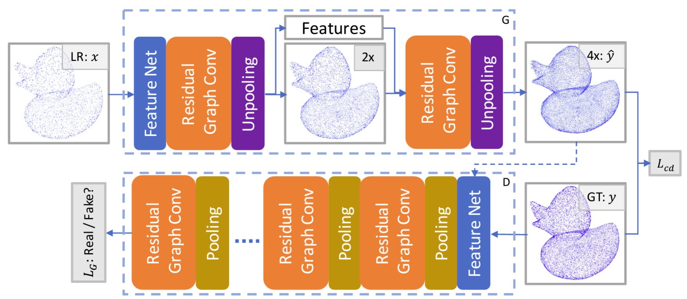
  - 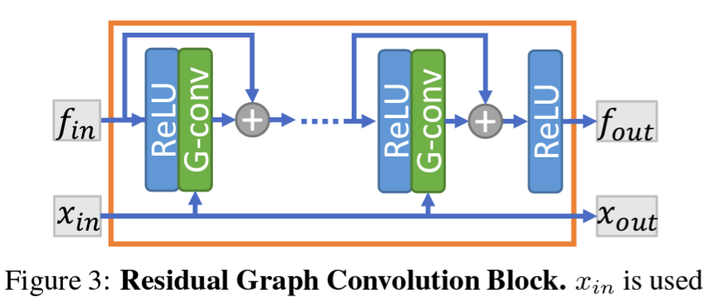
  - 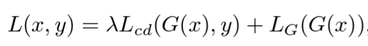
  - 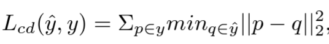
  - 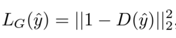
  - 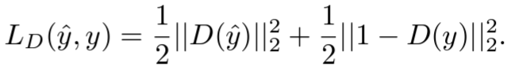
 

- [ ] **LassoNet: Deep Lasso-Selection of 3D Point Clouds [Scivis, 2019]** [[Paper]](pdfs/LassoNet_Deep_Lasso-Selection_of_3D_Point_Clouds.pdf)
  - interactive visualization is important for data exploration and understanding. Intellegient data selection/filter is desired for an interactive volume visualization system, but it is difficult to achieve because of the occlusion from 3D volume projected to 2D image. For 3D point cloud or particle lasso selection, traditional heuristics-based algorithm are based on data property. Supervised DNN once trained on labeled dataset, can produce accurate 3D data with selection on 2D image and generalize to similar dataset. For point cloud data, permutation-variant neural networks like PointNet, which is MLP with global pooling, is usually adopted.
  - Jaccard distance between selected points and target points

 

- [ ] **(DGCNN) Dynamic Graph CNN for Learning on Point Clouds [ToG, 2019]** [[Paper]](pdfs/dgcnn.pdf)
  - EdgeConv -
    - $\square$: aggregation fn;
    - $h_\theta$ edge fn;
    - g: gauss kernel;
    - u: pairwise euc dist
    - (u,v) directed edge weight (local structure): $x_v-x_u$
      - x
    $$
    \begin{align*}
    \begin{split} 
      x_i' & = \underset{j:(i,j)\in \mathscr{E}}{\square}h_\theta(x_i, x_j) \\
      (1): x_{im}' & = \sum_{j:(i,j)\in\mathscr{(E)}}\theta_m \cdot x_j \\
      (2): x_i' & = \underset{j:(i,j)\in \mathscr{E}}{\sum}h_\theta(x_i) \\
      (3): x_i' & = \underset{j:(i,j)\in \mathscr{E}}{\sum}h_\theta(x_j)g(u(x_i,x_j)) \\
      (4): x_i' & = \underset{j:(i,j)\in \mathscr{E}}{\sum}h_\theta(x_j-x_i)\\
      (5, Chosen): x_i' & = \underset{j:(i,j)\in \mathscr{E}}{\sum}h_\theta(x_i \oplus (x_j-x_i)) \\
      x_{im}' & = \underset{j:(i,j)\in\mathscr{(E)}}{max}e_{ijm}'  \\
      e_{ijm}' & = ReLU(\theta_m\cdot(x_j-x_i)+\phi_m\cdot x_i) \\
      \Theta & = (\theta_1,...,\theta_M,\phi_1,...,\phi_M)
    \end{split}
    \end{align*}
    $$
    - Properties
      - Permutation invariance: with symmetric functions
      - 

 

- [ ] **Modeling Point Clouds with Self-Attention and Gumbel Subset Sampling [CVPR, 2019]** [[Paper]](pdfs/Yang_Modeling_Point_Clouds_With_Self-Attention_and_Gumbel_Subset_Sampling_CVPR_2019_paper.pdf)
  - Gumbel Subset Sampliong (GSS)
    - task-agnostic, permutation invariant, differentiable sampling.
    - QUESTION: Why is differentiability important?
  - Group Shuffle Attention (GSA)
    - more efficient than vanilla MHA

 

- [ ] **Learning to Sample [CVPR, 2019]** [[Paper]](pdfs/Dovrat_Learning_to_Sample_CVPR_2019_paper.pdf)
  - data-driven task-specific sampling 

 

- [x] **PU-GAN: a Point Cloud Upsampling Adversarial Network [ICCV, 2019]** [[Paper]](pdfs/1907.10844.pdf)
  - Contribution
    - First to apply GAN to upsampling task. Proposed UP-DOWN-UP unit to power generator.
    - compound loss: adversarial, reconstruction, and uniform
  - Architecture
    - 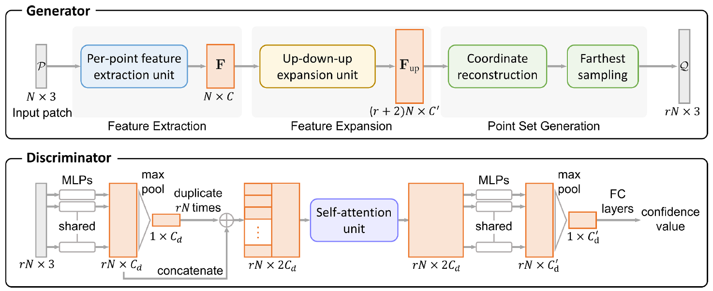
    - 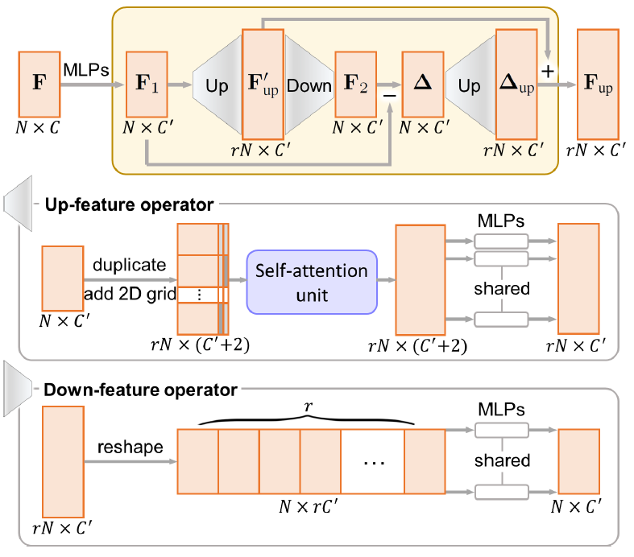
  - Loss Function

 

- [x] **PU-Net: Point Cloud Upsampling Network [CVPR, 2018]** [[Paper]](pdfs/Yu_PU-Net_Point_Cloud_CVPR_2018_paper.pdf)
  - PC super resolution challenge
    1. no spatial order and structure
    2. ~~PC should lie on object surface~~
    3. ~~should not clutter~~
     - 2,3 might not be necessary for particle data
  - **Design Intuition**:
    - learn multi-level feature (point feature embedding)
    - expand point with multi-branch conv (feature expansion)
    - joint loss encouraging uniform point placement (repulsion loss)
  - 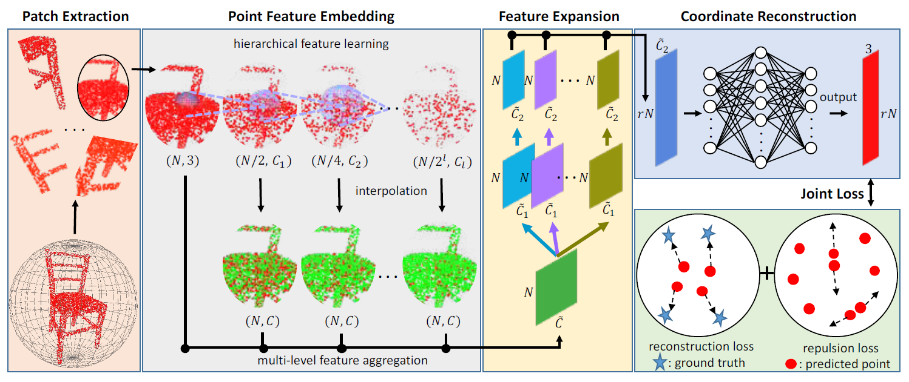
  - Point Feature Embedding
    - pointnet++ hierachical feature learner
    - For each hierachy
      - interpolate to get N points
      - 1x1 conv to get C features
  - Feature Expansion
    - concatenate (N, C)s = (N, $\hat{C}$)
    - Then *feature expansion*
      - $f'=RS([C_1^2(C_1^1(f)), ... , C_r^2(C_r^1(f))])$
        - two 1x1 conv to expand channels
        - (N, $\hat{C}$) -> (N, $r\hat{C_1}$) -> (N, $r\hat{C_2}$) -> reshape-(rN, $\hat{C_2}$)
  - Coordinate Reconstruction
    - MLP((rN, $\hat{C_2}$)) -> (rN, 3)
  - Joint Loss Function
    - reconstruction loss: EMD/CD (EMD better capture shape)
    - repulsion loss:
      - 
        - $\eta(r) = -r$, $w(r)=e^{-r^2/h^2}$
    - 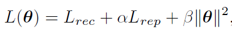

 

- [x] **PCN: Point Completion Network [3DV, 2018]** [[Paper]](pdfs/point_completion_network.pdf)
  - Entended PointNet encoder -> MLP + Folding Decoder with 2-stage up sampling
    - 1st stage: latent *v* -> coarse point cloud
    - 2nd stage: for each point *p* in coarse, upsampling by generating neigbhor points with *p*, *v* and folding
  - 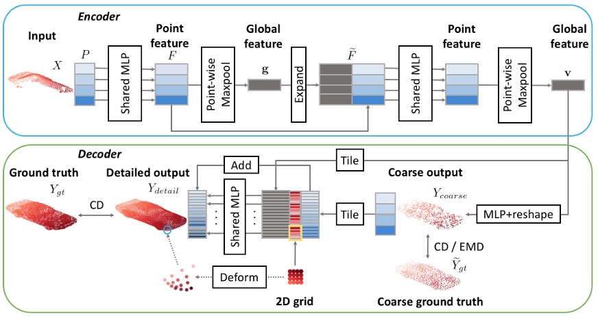

 

- [x] **VoxelContext-Net: An Octree based Framework for Point Cloud Compression [CVPR, 2021]** [[Paper]](pdfs/VoxelContext-Net_An_Octree_Based_Framework_for_Point_Cloud_Compression_CVPR_2021_paper.pdf)
  > Point Cloud -> Octree -> Occupancy Volume ->
  > Arithmetic Encoding: P(8-bit-string/tree node) learned by deep entropy NN ->
  > Arithmetic Decoding: Cooordinate Refinement: Octree Coordinate + Offset
  > Temporal learning: *local voxel context* enhanced by the *context* at same depth from previous and next point cloud, and is used in deep entropy model. (not used in coordinate refinement network). 
  - *local voxel context*: surrounding voxel in the Occupancy Volume
  - Encoding P(node) NN design:
    - take 8-bit string and the *local voxel context* (surrounding voxel in the Occupancy Volume) 
    - predict P(node), which is actually P(node | bitstring, voxel context)
  - Decoding Offset Formulation:
    - get FULL occupancy volume, find *local voxel context*, feed in a NN to get offset
    - final point position: octree coordinate + NN(voxel context)

- [ ] **Deep Learning for 3D Point Clouds: A Survey [arxiv, 2020]** [[Paper]](pdfs/dl-for-pc-survey.pdf)

 

- [x] **PointNet: Deep Learning on Point Sets for 3D Classification and Segmentation [CVPR, 2017]** [[Papers]](pdfs/pointnet.pdf)
  - permutation invariant point cloud network

 

- [ ] **PointNet++: Deep Hierarchical Feature Learning on Point Sets in a Metric Space [NIPS, 2017]** [[Paper]](pdfs/pointnet++.pdf)
  - hierachical PointNet

 

- [ ] **PointCNN: Convolution On X-Transformed Points [NIPS, 2018]** [[Paper]](pdfs/pointcnn.pdf)

 

- [x] **FoldingNet: Point Cloud Auto-encoder via Deep Grid Deformation [CVPR, 2018]** [[Paper]](pdfs/1712.07262.pdf)
  - **Intuition**
    - the 2D coordinate differentiate the replicated latent to avoid reconstruction collapses to same coordinates
      - when decoding, latent is replicated and then transoformed. Without the coordinate, empirically the reconstruction will be replications of points (all points collapsing to the same value).
      - TO BE SHOWN: folding avoids the above problem, by Sformer experiment.
  - Encoder: Graph-based encoder (with permutaiton invariant proof)
  - Decoder: 
    - input/output: latent + 2D coordinate -> 3D Point Coordinate
    - Architecture: 
      - intput: latent + 2D Grid -> input
      - **Foldings**:
        - 1st folding (MLP): input -> intermediate point cloud
        - 2nd folding (MLP): latent + intermediate point cloud -> final point cloud
      - output: final point cloud

 

- [x] **TearingNet: Point Cloud Autoencoder to Learn Topology-Friendly Representations** [[Paper]](pdfs/tearingnet.pdf)
  - Intuition: By "tearing" (i.e. modifying the 2D Grid preped for *folding*) can facilitate topology property (i.e. connectivity) learning for PC reconstruction
  - Encoder: Graph-based encoder 
  - Decoder:
    - input/output: latent + 2D coordinate -> 3D Point Coordinate
    - Architecture: 
      - intput: latent + 2D Grid -> input
      - Fold-**Tear**-Fold (F-T-F):
        - Folding (MLP): input -> intermediate point cloud
        - **Tearing** (MLP): latent + 2D Grid + intermediate point cloud -> 2D Grid Updating Residual
        - Final Folding (MLP): latent + Updated 2D Grid -> final point cloud
      - output: final point cloud
      - note: (F-T before Final Folding can be repreated like F-T-**F-T-F-T**-F for iterative 2D Grid update)

 