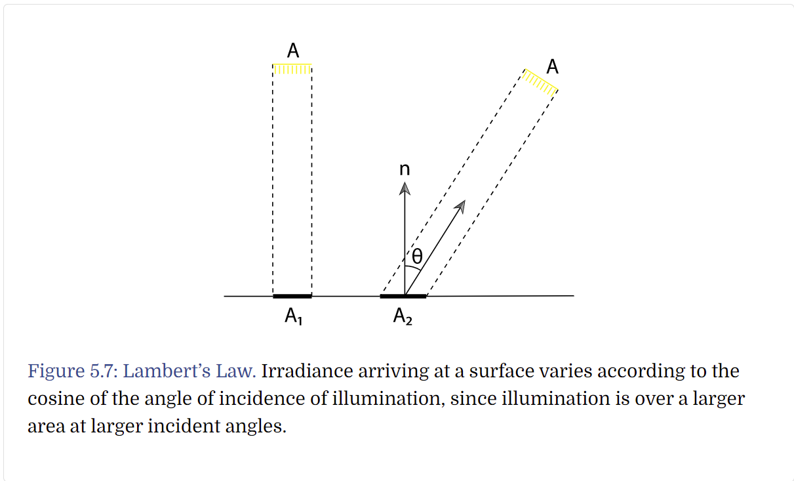
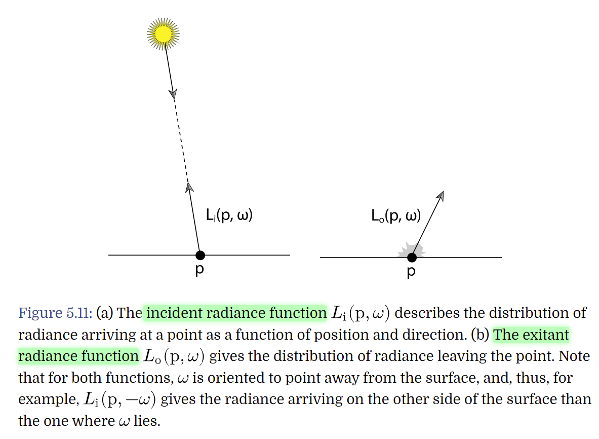
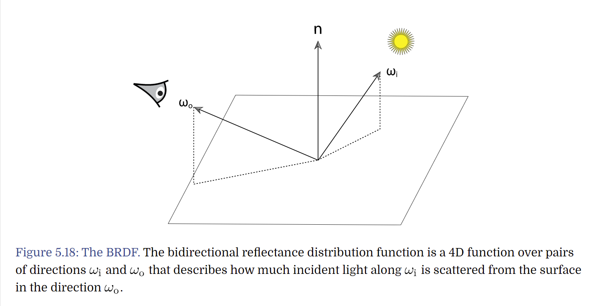

# [Book](https://www.pbr-book.org/3ed-2018/contents)
- [Book](#book)
  - [5) Color and Radiometry](#5-color-and-radiometry)

## 5) Color and Radiometry
  - ### 5.4 Radiometry
    - provides a set of ideas and mathematical tools to describe light propagation and reflection.
    - Assumptions of light:
      - linearity
      - energy conservation
      - no polarization
      - No fluorescence or phosphorescence
      - Steady state
    - *Energy*
      - $Q =\frac{hc}{\lambda}$, Joules
        - h: Planck’s constant; c: light speed; $\lambda$: wavelength
    - *Flux*
      - Radiant flux, also known as power, is the total amount of energy passing through a surface or region of space per unit time.
      - $\Phi=lim_{\Delta t\rightarrow0}\frac{\Delta Q}{\Delta t}=\frac{dQ}{dt}$, J/s or Watts
    - *Irradiance and Radiant Exitance*
      - Given finite area A, average density of power over it
        - $E=\Phi/A$,
          - at a point: $E=\frac{\partial\Phi}{\partial A}$
        - *irradiance (E)*: flux area density arriving surface
        - *radiant exitance (M)*: -------------- leaving ----------.
      - Extension: *Lambert's Law*
        - light energy arriving at a surface is proportional to the cosine of the angle between the light direction and the surface normal
        - 
    - *Solid Angle and Intensity*
      - *solid angle*: angle on a sphere, sphere=4pi *steradians(sr)*
        - 
        - 
      - *Intensity*
        - radiant flux per unit solid angle
        - describes directional distribution of light
        - $I=\frac{\partial\Phi}{\partial\Omega}$
    - ***Radiance***
      - irradiance and radiance exitance gives differential power per differential area, but don't distringuish directional distribution of power
      - Radiance: flux density per unit area per unit solid angle
      - $L(p,\omega)=\lim_{\Delta\omega\rightarrow0}\frac{\Delta E_\omega(p)}{\Delta\omega}=\frac{d E_\omega(p)}{d\omega}$
        - $E_\omega$ irradiance at surface perpendicular to direction $\omega$
      - $L=\frac{d\Phi}{d\omega dA^\perp}$
      - **used most frequently**: other values can be computed in terms of integral over area and direction
    - ***Incident & Exitant Radiance Functions***
      - 
    - *Luminance*
      - measures how bright a Spetral Power Distribution appears to human.
  - ### 5.6 Surface Reflection
    - BRDF
      - describes how much incident light along $\omega_i$ is scattered from the surface in the direction $\omega_o$
      - 