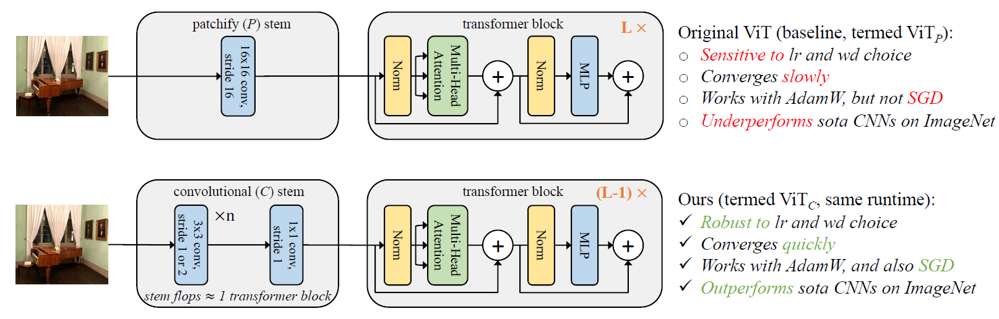
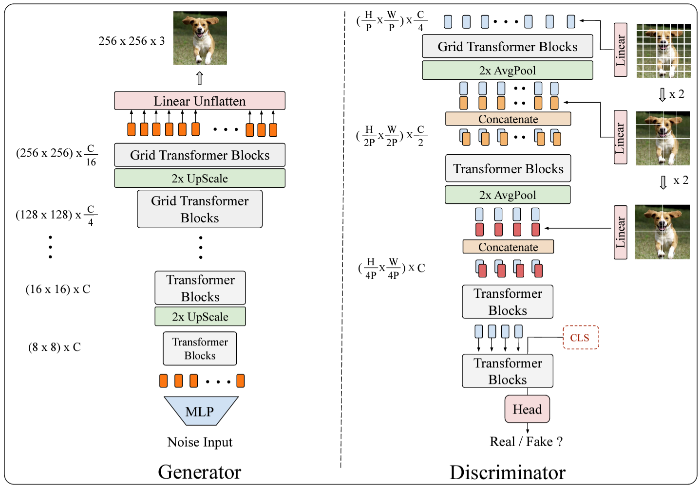
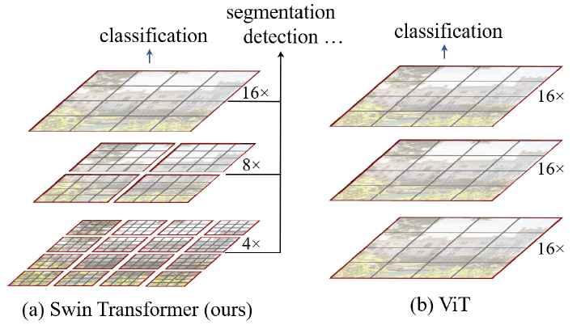
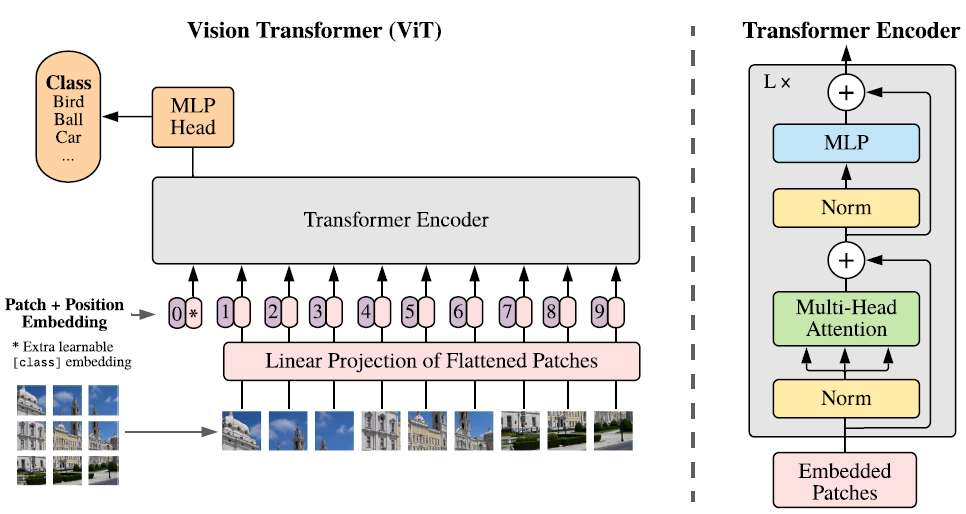

## [Back](README.md)

 

### Transformer

 

- [ ] **Early Convolutions Help Transformers See Better [2021]** [[Paper]](pdfs/Early-Convolutions-Help-Transformers-See-Better.pdf)
  - **early CNN layer helps Transformer opitmization**
    - robust to **hyperparameter** (lr and wd choice)
    - **converge** quickly
    - works with AdamW, and **SGD**
    - outperforms SOTA CNN
  - 

 

- [ ] **Self-attention Does Not Need O($n^2$) Memory [arxiv, 2021]** Google Research [[Paper]](pdfs/2112.05682.pdf)

 

- [ ] **TransGAN: Two Pure Transformers Can Make One Strong GAN, and That Can Scale Up [NIPS, 2021]** [[Paper]](pdfs/2102.07074.pdf)
  - 

 

- [ ] **Swin Transformer: Hierarchical Vision Transformer using Shifted Windows [ICCV, 2021]** [[Paper]](pdfs/2103.14030.pdf)
  - Hierachical ViT with bigger and bigger image patch and with shiftid uneven patch window
  - 
 

- [ ] **(ViT) An Image is Worth 16x16 Words: Transformers for Image Recognition at Scale [ICLR, 2021]** [[Paper]](pdfs/2010.11929.pdf)
  - Image to patch sequence (16x16) into transformer blocks
  - ViT vs CNN:
    - ViT:
      - suitable for scaling large model
      - potential of multimodel learning
      - global feature attention
    - CNN:
      - suitable for small model
      - local feature attention
  - A hybrid of CNN and ViT can be beneficial to leverage arbitrary length of attention while accelerate training with CNN's inductive bias
  - 
 

- [ ] **Attention Mechanisms in Computer Vision: A Survey** [[Paper]](pdfs/attention_in_cv.pdf)

 

- [x] **Attention Is All You Need** [[Paper]](pdfs/1706.03762.pdf)

 