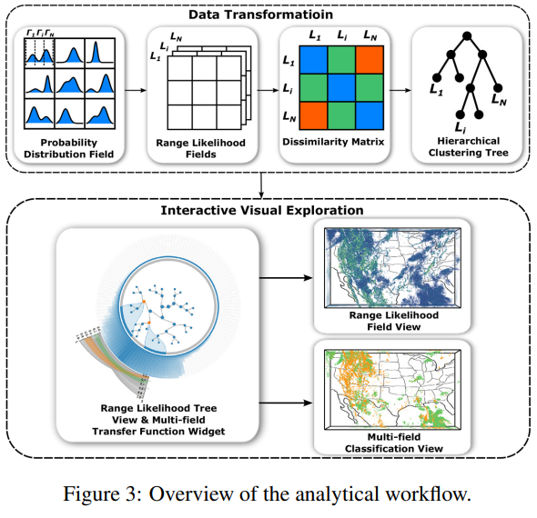

## [Back](README.md)

 

### Uncertainty and Ensemble Vis

 

- [ ] **Uncertainty Visualization of the Marching Squares and Marching Cubes Topology Cases [Vis Short, 2021]** Tushar M. Athawale, Sudhanshu Sane, Chris R. Johnson [[Paper]](pdfs/uncertain_visualization_of_marching_cubes_topology_cases.pdf)

 

- [ ] **Visual Analysis of Multi-Parameter Distributions across Ensembles of 3D Fields [TVCG, 2021]** [[Paper]](pdfs/Visual_Analysis_of_Multi-Parameter_Distributions_across_Ensembles_of_3D_Fields.pdf)

 

- [ ] **Uncertainty-Oriented Ensemble Data Visualization and Exploration using Variable Spatial Spreading [TVCG, 2021]** [[Paper]](pdfs/Uncertainty-Oriented_Ensemble_Data_Visualization_and_Exploration_using_Variable_Spatial_Spreading.pdf)

 

- [ ] **Ensemble Vis Survey [TVCG, 2020]** J. Wang [[Paper]](pdfs/EnsembleSurvey.pdf)
  - Uncertain Rendering:
    - Level Crossing Probability paper (Positional Uncertainty of Isocontrous...)
    - Probabilistic Marching Cubes

 

- [ ] **Uncertainty-Aware Principal Component Analysis [TVCG, 2020]** J. Görtler, T. Spinner, D. Streeb, D. Weiskopf and O. Deussen [[Paper]](pdfs/Uncertainty-Aware_Principal_Component_Analysis.pdf)

 

- [ ] **eFESTA: Ensemble Feature Exploration with Surface Density Estimates [TVCG, 2020]** W. He, H. Guo, H. Shen and T. Peterka [[Paper]](pdfs/eFESTA_Ensemble_Feature_Exploration_with_Surface_Density_Estimates.pdf)

 

- [ ] **CECAV-DNN: Collective Ensemble Comparison and Visualization using Deep Neural Networks [Visual Informatics, 2020]**[[Paper]](pdfs/1-s2.0-S2468502X20300164-main.pdf)
  - A binary classfication network predicting whether a member scalar field belongs to 1 of the 2 ensembles.
  - 1. dissimilarity comparison
    - Wasserstien distance, as loss function, is used to measure the dissimilarity
  - 2. member comparison
    - classification score as indicator of common member between ensembles: even score -> common; extreme score -> different

 

- [x] **Direct Volume Rendering with Nonparametric Models of Uncertainty [TVCG, 2020]** T. Athawale and C. R. Johnson [[Paper]](pdfs/dvr_nonparametric_uncertainty.pdf)
  > Using nonparametric quantile distribution, which is mode-preserving and variance-bounded (?), analytical trilinear quantile interpolation, and TF integration over quatile distribution, uncertainty in DVR pipeline can be propagated, giving more accurate uncertain VR of w.r.t. the underlying ground truth data shown in synthetic dataset

 

- [ ] **Probabilistic Asymptotic Decider for Topological Ambiguity Resolution in Level-Set Extraction for Uncertain 2D Data [TVCG, 2019]** T. Athawale and C. R. Johnson [[Paper]](pdfs/Probabilistic_Asymptotic_Decider_for_Topological_Ambiguity_Resolution_in_Level-Set_Extraction_for_Uncertain_2D_Data.pdf)

 

- [ ] **Visualization of Uncertainty for Computationally Intensive Simulations Using High Fidelity Emulators [SciVis, 2018]** A. Biswas, K. R. Moran, E. Lawrence and J. Ahrens [[Paper]](pdfs/Visualization_of_Uncertainty_for_Computationally_Intensive_Simulations_Using_High_Fidelity_Emulators.pdf)

 

- [ ] **Information Guided Exploration of Scalar Values and Isocontours in Ensemble Datasets [Entropy, 2018]** Subhashis Hazarika, Ayan Biswas, Soumya Dutta, Han-Wei Shen [[Paper]](pdfs/entropy-20-00540.pdf)

 

- [ ] **Uncertainty Visualization Using Copula-Based Analysis in Mixed Distribution Models [TVCG, 2017]** Subhashis Hazarika [[Paper]](pdfs/Uncertainty_Visualization_Using_Copula-Based_Analysis_in_Mixed_Distribution_Models.pdf)

 

- [x] **A Statistical Direct Volume Rendering Framework for Visualization of Uncertain Data [TVCG, 2017]** E. Sakhaee and A. Entezari [[Paper]](pdfs/A_Statistical_Direct_Volume_Rendering_Framework_for_Visualization_of_Uncertain_Data.pdf)
  > Modelled ensemble scalar fields as nonparametric pdf random field (e.g. histogram) with analytical interpolation by box-spline convolution. Integrating pdfs over TF further propagates uncertainty to the DVR pipeline

  - Goal: propagate uncertainty thruout entire DVR pipeline with nonparametric model(with analytical solution)
    - Q1: what's the probability distribution of the random field at an arbitrary point along a viewing ray? (pdf interpolation)
    - Q2: how to analytically incorporate the probability distribution in the volume rendering intergral? (uncertain-aware TF classification)
  - Uncertainty modelling
    - ensemble scalar fields as random variable field with non-parametric pdfs
  - Box-Splines for Non-Parametric PDF Interpolation
    - interpolated random variable X as convolution
      - $pdf_X(x)=pdf_{w_1X_1}(x)*pdf_{w_2X_2}(x)*...*pdf_{w_KX_K}(x)$ 
        - where $pdf_{w_iX_i}=\frac{1}{w_i}pdf_{X_i}(x/w_i)$
      - (NOT UNDERSTANDING) BOX SPLINE SPACE IS CLOSED UNDER CONVOLUTION:
        - implication: conv of box-splines can be represented with anther box-spline, containing all weights as directions
        - $pdf_X(x)=M_{[w_1,w_2,...,w_K]}(x)$
          - when all $w_i=1$, box-spline is univariate B-spline with equally spaced knots. (so what? significance?)
  - Probabilistic Transfer Function Classification
    - For a random varialbe at arbitrary postion, integrate its pdf with TF.
      - Ex. Opacity: $E(\alpha)=\int\alpha(t)pdf_X(t)dt$
  - Results:
    - real-time rendering (>30 fps)
    - reveals fine features with transfer function highlighting feature isovalues, comparing to fuzzy isosurfacing, LCP field DVR, and gaussian process regression (?)

 

- [ ] **Range Likelihood Tree: A Compact and Effective Representation for Visual Exploration of Uncertain Data Sets [Pvis, 2017]** [[Paper]](pdfs/Range_likelihood_tree_A_compact_and_effective_representation_for_visual_exploration_of_uncertain_data_sets.pdf)
  - For a probability distribution field, break each pdf into ranges (cumulative denstiy) and make a Hierarchical Clustering Tree based on the similarity values (across grid points) for each range
  - 

 

- [ ] **Visual Analysis of Spatial Variability and Global Correlations in Ensembles of Iso‐Contours [EuroVis, 2016]** F. Ferstl,M. Kanzler,M. Rautenhaus,R. Westermann [[Paper]](pdfs/cgf.12898.pdf)

 

- [x] **Nonparametric Models for Uncertainty Visualization [EuroVis, 2013]** Kai Pöthkow, Hans-Christian Hege [[Paper]](pdfs/cgf.12100.pdf)
  > Explore ensemble data as nonparametric representations of (a): empirical distributions, (b): histograms, (c): KDE, instead of the previously explored Gaussian field
  > NOTE: one KDE for entir dataset; NOT on vertices
  > For KDE, methods proposed to 1) compute valid consistent marginal distributions, 2) get correlations with principal component transformation, 3) automatic bandwidth selection
  - **Nonparametric Models**
    - **Empirical Distribution (confused)**:
      - $f(y)=\sum_{i=1}^L\phi _i\delta (y-v_i)$
      - sum of $v_i=y$ weighted by $\phi_i$
      - How is this a probability
    - Historgram
    - Kernel Density Estimate
      - $f(y,H)=\sum_{i=1}^L\phi _i\kappa(y;v_i,H)$
      - flavors of bandwidith matrix H:
        - gaussian kernel: $H \lrArr \Sigma$
        - 1.) scaled identity $H=h^2I$. constant variance
        - 2.) diagonal $H=diag(h_1^2, h_2^2, ... , h_{\chi M}^2)$. individual bandwidth, no correlation
        - 3.) symmetric positive definite matrices, representing bandwidth with linear dependencies
      - bandwidth selection
        - 1.) Mean Integrated Squared Error
          - MISE(H) = $E(\int(f(x,H)-f^*(x))^2dx)$
            - approx: asymptotic MISE
        - 2.) Silverman's rule of thumb
          - $h_i=(\frac{4}{d+2})^{\frac{1}{(d+4)}}L^\frac{-1}{d+4}\sigma_i$
          - L: # of data points
    - **Marginalization**
      - For local feature probability (e.g. LCP) outside-cell points should be marginalized
      - $K_c$: # of points (i.e. dof) for cell c
      - $\chi$: # of variables per point (i.e. state space dimension)
      - Empirical Distribution
        - discard spare dimensions
      - Histogram
        - compute joint hist of local/cell points
      - KDE
        - Gaussian kernel: $H_c$ drops spare dimensions
    - **Principal Components Transformation**
      - symmetric positive definite $H$ hard to estimate in high dim
      - PCA applied to 0-mean realizations and then KDE
      - $A=[(v_{1,c}-\mu), (v_{1,c}-\mu), ..., (v_{L,c}-\mu)]$
      - $B=KLT(A)=[m(v_{1,c}-\mu), m(v_{1,c}-\mu), ..., m(v_{L,c}-\mu)]$
        - m is transformation matrix (i.e. eigenvectors in PCA(?))
    - **Feature Probability**
      - $P(c)=\int_Df_c(y_c)dy_c=\int_{\real^{\chi K_c}}f_c(y_c)I(c, y_c)d_yc=E(I(c,\cdot))$
      - $f_c$: pdf of cell
      - $I(c,y)$: feature indicator function in cell c with components y

  > Takeaways:
  > - Usage of Uncertainty in Scivis: represent data as distribution fields. Research opportunities arise in
  >   - different types of distributions (e.g. param/nonparam)
  >   - Uncertainty Propagation: integrate distribution to traditional algorihtms (LCP, DVR, etc.)

 

- [ ] **Gaussian mixture model based volume visualization [LDAV, 2012]** S. Liu, J. A. Levine, P. Bremer and V. Pascucci [[Paper]](pdfs/Gaussian_mixture_model_based_volume_visualization.pdf)
  - GMM in voxel neighborhood level or voxel ensemble level
  - **Fuzzy Rendering**
    - For each frame, each vtx draws GMM sample, ray casting.
    - Fuzzyness: different samples each frame creates varying VR.
  - **MC Integration for Static Uncertain VR**
    - Drawback of FR: needs animation to convery uncertainty/distribution
    - 

 

- [ ] **Fuzzy Volume Rendering [TVCG, 2012]** N. Fout and K. Ma [[Paper]](pdfs/Fuzzy_Volume_Rendering.pdf)

 

- [ ] **Analysis of large-scale scalar data using hixels [LDAV, 2011]** D. Thompson et al [[Paper]](pdfs/Analysis_of_large-scale_scalar_data_using_hixels.pdf)

 

- [x] **Probabilistic Marching Cubes [EuroVis, 2011]** Kai Pöthkow,Britta Weber,Hans-Christian Hege [[Paper]](pdfs/probabilistic_marching_cubes.pdf)
  - [Uncertain Isocontour Markdown](UncertainIsocontour.md)

 

- [x] **Positional Uncertainty of Isocontours: Condition Analysis and Probabilistic Measures [TVCG, 2010]** K. Pothkow and H. Hege [[Paper]](pdfs/Positional_Uncertainty_of_Isocontours_Condition_Analysis_and_Probabilistic_Measures.pdf)
  - [Uncertain Isocontour Markdown](UncertainIsocontour.md)

 
